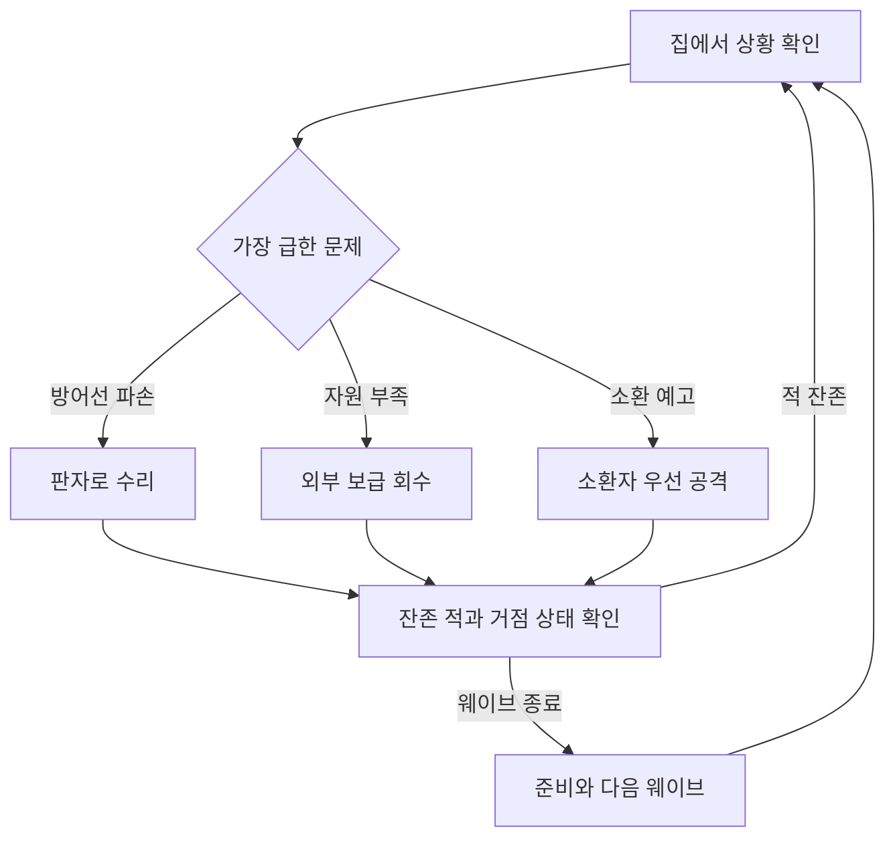
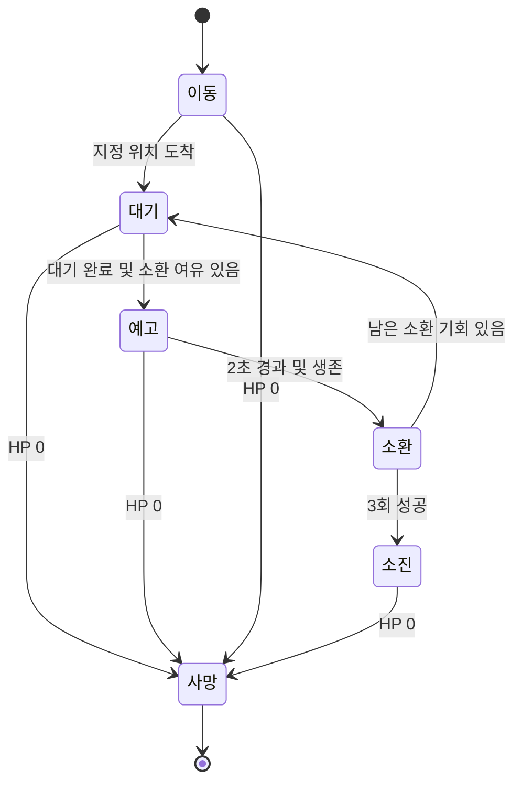

# TPS 좀비 서바이벌 상세 기획서

버전: v0.1 / 작성일: 2026-09-16 / 상태: 프로토타입 설계 초안

기반 자료: 「TPS 게임 기본 구상 (2장 요약)」 및 사용자가 추가한 일반 좀비·소환형 특수 좀비 구상. 기존 요약본을 바탕으로 작성한 별도의 확장 문서다.

## 1. 결정 상태와 기획 목표

**한 줄 콘셉트:** 집을 지키기 위해 밖에서 보급품을 모으고, 좀비를 증원하는 특수 개체를 처치할 시점을 판단하는 거점 방어 슈팅 게임.

| 구분 | 내용 |
|---|---|
| 사용자 구상 | 일반 좀비와 주변에 일반 좀비를 생성하는 특수 좀비, 두 종류를 웨이브에 활용 |
| 기존 요약본 유지 | TPS 조작, 중앙 하우스와 외부 필드, 외곽 생성 지점, 30초 보급 주기, 바리케이드 3단계 |
| 기존 수치 유지 | 탄약 확률 45%·30발·한도 120발, 회복약 25%·체력 50% 회복·한도 3개, 판자 30%·한도 10개 |
| 변경 제안 | 무한 적 생성을 유한한 5개 웨이브 프로토타입으로 우선 검증. 적 체력의 시간 비례 증가는 우선 보류 |
| 신규 제안 | 거점 보관소 내구도, 준비 시간, 소환 횟수 제한, 보급 개수·최소 보장, 조작과 상세 수치 |
| 미정 | 최종 플랫폼, 엔진, 팀 규모·일정, 최종 시점 변경 여부, 아트, 판매 방식, 무한 모드 채택 |

**아래에서 별도로 ‘기존’ 또는 ‘사용자 구상’이라고 표시하지 않은 규칙과 수치는 모두 검증용 제안이다. 승인된 최종 사양이나 플레이 테스트 결과가 아니다.** 구현 기준을 일관되게 만들기 위해 프로토타입은 PC 키보드·마우스, 싱글플레이 TPS로 가정한다.

목표 경험은 ‘지금 수리할지, 보급하러 갈지, 소환자를 먼저 제거할지’를 판단하는 것이다. 숙련자는 조준 정확도뿐 아니라 외출 경로, 귀환 시점, 탄약 소비, 소환 차단 시점을 최적화한다.

핵심 검증 가설: 소환형 좀비가 등장하면 플레이어의 행동이 단순한 문 앞 사격에서 우선순위 판단으로 바뀌는가? 거점을 완전히 포기하거나 실내에만 머무는 한 가지 전략이 항상 유리하지 않은가?

## 2. 플레이 범위와 종료 조건

| 항목 | 프로토타입 제안 |
|---|---|
| 목표 | 5번째 웨이브까지 생존하며 보관소 보호 |
| 승리 | 마지막 웨이브의 예정 생성 완료 및 모든 살아 있는 적 제거 |
| 패배 | 플레이어 HP 또는 보관소 내구도 0 |
| 한 판 | 약 10~15분을 검증 목표로 설정. 실제 시간은 처치·소환 속도에 따라 달라짐 |
| 시작 자원 | 장전 30발, 예비탄 90발, 회복약 1개, 판자 4개 |
| 초기 방어 | 입구 2곳·창문 2곳, 각각 1단계 바리케이드 설치 |
| 판 사이 | 성장·아이템 이월 없음. 클리어 시간과 받은 피해를 기록 |
| 제외 범위 | 멀티플레이, 보스, 추가 좀비 종, 무기 제작, 스킬 트리, 영구 성장, 온라인 랭킹 |

보관소 내구도는 원문에 없는 추가안이다. 집을 버리고 계속 달아나는 전략에도 대가를 주기 위한 장치다. 채택하지 않는다면 거점의 필요성을 별도로 재설계해야 한다. 이 초안에서는 보관소를 공격 가능한 거점 목표물로 사용하며, 별도 보관 인벤토리 UI는 만들지 않는다.

## 3. 핵심 루프와 정보

| 시간 규모 | 행동과 반응 | 보상·다음 판단 |
|---|---|---|
| 수 초 | 조준·사격으로 접근 적 제거, 공격 예고를 보고 이동 | 통로 확보, 탄약 소모와 거리 유지 판단 |
| 수십 초 | 집의 상태를 확인하고 보급품 회수 또는 소환자 처치 | 탄약·판자 확보, 향후 증원 감소 |
| 한 웨이브 | 전투·수리·외출을 병행한 뒤 잔존 적 정리 | 준비 시간 확보, 다음 공격 방향에 맞춰 재정비 |
| 한 판 | 일반 적 대응 학습 후 소환자·다방향 공격 해결 | 클리어, 시간·피해 기록 비교 |

일일 과제나 장기 성장 루프는 현재 범위에 포함하지 않는다. 먼저 같은 맵과 두 적만으로 다시 플레이할 이유가 생기는지 확인한다.

## 4. 맵과 거점

| 구역 | 구성 | 플레이 의도 |
|---|---|---|
| 중앙 | 단층 하우스, 보관소, 네 방어 지점 | 익숙한 귀환 지점과 공격 방향 판단 기준 |
| 근거리 필드 | 집 둘레 이동로, 일부 보급 지점 | 짧게 나가 소량 회수하는 선택 |
| 원거리 필드 | 엄폐물과 보급 지점, 귀환 우회로 | 더 멀리 이동하며 적을 피하는 위험 |
| 외곽 | 안개와 방향별 적 생성 지점 | 공격 방향 예고와 적 유입 |

제안 블록아웃: 플레이 가능 구역 약 60×60m, 집 약 10×10m. 집 중심에서 8~15m에 가까운 보급, 18~25m에 먼 보급 지점을 둔다. 외곽은 이동 불가 경계로 표시한다. 수치는 이동 시간과 실내 카메라 테스트 후 변경한다.

집 출입구 두 곳은 플레이어가 왕복 가능한 크기로 둔다. 창문은 플레이어가 통과하지 못하지만 파괴 후 좀비가 침입할 수 있다. 창문 통과는 별도 이동 링크 또는 진입 동작으로 처리한다. 바리케이드는 플레이어 출입 동선과 충돌하지 않게 우회 상호작용 통로를 제공하거나, 출입 시 열리는 구조로 구현한다. MVP에서는 플레이어만 통과할 수 있는 출입 판정을 사용하며 화면에 이를 명확히 표현한다.

소환자가 집 뒤 장애물에 가려져 대응 불가능해지지 않도록 외부 사격 위치를 최소 두 곳 확보한다. 모든 소환 대기 지점에서 보관소까지 일반 좀비의 이동 경로가 있어야 한다.

## 5. 플레이어 조작·전투

| 입력 | 기능 | 조건 |
|---|---|---|
| WASD / 마우스 | 이동 / 카메라 회전 | 메뉴·결과 화면에서는 비활성 |
| 우클릭 / 좌클릭 | 조준 / 발사 | 사격은 장전·수리·회복 중 불가 |
| R | 재장전 | 예비탄이 있고 탄창이 가득 차지 않았을 때 |
| E | 아이템 획득, 바리케이드 수리 | 대상과 2m 이내, 시야 차단 없음 |
| G 길게 | 바리케이드 단계 강화 | 자원·단계 조건 충족 |
| Q | 회복약 사용 | HP가 최대 미만이고 회복약 보유 |
| Esc | 일시정지 | 모든 게임 시간과 생성 타이머 정지 |

| 기본 값 | 제안 |
|---|---:|
| 플레이어 HP | 100 |
| 이동 속도 / 조준 이동 속도 | 5 / 3 m/s |
| 총기 | 소총 1종, 즉시 명중 판정 |
| 몸통 피해 / 머리 배율 | 20 / 1.5배 |
| 발사 간격 / 재장전 | 0.2초 / 2초 |
| 탄창 / 예비탄 최대 | 30 / 120발 |
| 회복약 사용 시간 | 1.5초 |
| 보관소 내구도 | 500, 이번 판 수리 불가 |

기존 ‘120발’은 이 초안에서 예비탄 한도로 해석한다. 탄창 포함 총 한도 120발을 의도했다면 변경해야 한다. 회복량은 최대 HP의 50%, 초과분은 버린다. 회복 완료 시 약을 소모하며 피격·사격·수리 입력으로 중단하면 소모하지 않는다. 재장전 완료 시에만 탄창으로 이전하며 중단하면 이전하지 않는다.

카메라 조준점으로 목표를 구하되 총구와 목표 사이 장애물을 다시 검사한다. 벽 뒤에서 카메라만 내밀어 발사하는 상황을 방지한다. 창문 사격 틈은 플레이어와 좀비의 충돌 판정에서 일관되게 보인다. 실내 벽에 카메라가 가까워지면 카메라 거리를 줄인다.

## 6. 적 2종의 역할

| 구분 | 일반 좀비 | 소환형 특수 좀비: 가칭 소환자 |
|---|---|---|
| 목적 | 접근·침입으로 즉시 방어 압박 | 방치하면 일반 좀비가 늘어나는 미래 압박 |
| 주요 행동 | 이동, 근접 공격, 바리케이드 파괴 | 외부 위치 확보, 예고 후 주변 일반 좀비 생성 |
| 요구 판단 | 어느 통로를 먼저 막을지 | 현재 전선을 지킬지 소환자를 제거할지 |
| HP / 이동 속도 | 60 / 1.8m/s | 160 / 1.2m/s |
| 공격 | 10 피해, 1.5초 간격 | 직접 공격 없음 |
| 식별 | 앞으로 기운 실루엣, 근거리 신음 | 큰 상체, 상승한 팔, 고유 소환음 |
| 처치 보상 | 위협 제거, 자원 드롭 없음 | 남은 소환 차단, 자원 드롭 없음 |

두 적은 체력만 다른 관계가 아니라 즉시 피해와 증원이라는 다른 문제를 만든다. 소환자는 무조건 최우선 정답이 되지 않도록 등장 시점·위치를 바꾸되, 초기에는 한 마리만 등장시켜 역할을 학습하게 한다.

### 6.1 일반 좀비 행동 규칙

1. 8m 이내에서 플레이어를 보고 도달 가능한 경로가 있으면 추적한다.
2. 플레이어를 놓친 뒤 3초 동안 마지막 위치로 이동하고 다시 발견하지 못하면 거점 공격으로 복귀한다.
3. 기본 목표는 보관소다. 보관소로 통하는 열린 진입로가 있으면 진입하고, 없으면 경로 비용이 가장 낮은 바리케이드로 이동한다.
4. 선택한 경로가 막히거나 현재 목표가 파괴되면 다시 경로를 계산한다. 목표 선택은 0.5초 간격으로 제한하고 현재 목표를 우선해 왕복을 줄인다.
5. 1.2m 이내에서 0.4초 공격 예고 후 타격한다. 타격 시 거리와 차단물을 다시 검사해 벽 너머 피해를 방지한다.
6. 플레이어에게 피해를 받으면 8m 이내이고 추적 가능한 경우 플레이어로 목표를 바꾼다. 나머지 개체는 거점 압박을 계속한다.

동일 대상에 여러 적이 동시에 공격할 수 있다. 플레이어 피격 무적은 우선 넣지 않으며, 겹침으로 즉사하는 문제가 있으면 공격 자리 수와 적 충돌부터 조정한다. 공격 자리 포화 시 대기하거나 다른 진입로를 탐색한다.

### 6.2 소환자 행동과 상태

소환자는 집 외부의 지정 대기 지점으로 이동한다. 지점은 집 중심에서 약 12~20m 거리에 배치하고 소환 가능한 공간과 접근 경로를 사전 검증한다. 자동 도주·회복·원거리 공격은 구현하지 않는다.

| 소환 항목 | 제안 규칙 |
|---|---|
| 첫 소환 | 대기 지점 도착 후 4초 대기하고 예고 시작 |
| 예고 | 2초간 팔 동작·고유음·바닥 표시. 그동안 이동하지 않음 |
| 반복 | 성공한 소환 완료 후 12초 대기하고 다음 예고 시작 |
| 생성 수 | 1회 최대 일반 좀비 2마리 |
| 범위 | 소환자 기준 수평 거리 2~4m의 고리 영역 |
| 누적 횟수 | 한 소환자당 성공 소환 3회, 최대 6마리 |
| 귀속 생존 상한 | 한 소환자가 생성한 살아 있는 일반 좀비 최대 4마리 |
| 전체 생존 상한 | 일반·소환자 합계 30마리 |
| 중단 | 예고 중 소환자 사망 시 취소. 일반 피격은 취소하지 않음 |
| 소환자 사망 후 | 이미 생성한 일반 좀비는 남아 전투 지속 |
| 소진 후 | 고유 효과를 끄고 제자리 대기. 자동 사망하지 않음 |

**소환 위치 검사:** 이동 가능 바닥, 캡슐 충돌 없음, 보관소까지 이동 경로 존재, 집 실내 아님, 플레이어와 3m 이상, 생성 예정 위치끼리 겹침 없음. 유효 위치를 확보한 뒤 예고 표시를 띄우고 완료 시 다시 검사한다. 생성 직후 0.8초는 이동·공격 없이 출현 연출을 진행하며 피해는 받을 수 있다.

한 슬롯만 유효하면 1마리만 생성하고 성공 횟수를 1회 소모한다. 둘 다 실패하면 횟수를 소모하지 않고 3초 후 다시 시도한다. 전체 또는 귀속 상한에 막혀도 같은 재시도 규칙을 쓴다. 취소·실패한 예고 표시는 즉시 제거한다. 개체별로 상한 슬롯을 예약해 동시 완료 시 30마리를 초과하지 않게 한다. 예정 웨이브 생성이 대기 중이면 예정 생성에 슬롯 우선권을 준다.

소환 횟수를 모두 쓴 개체도 웨이브 종료 전 처치해야 한다. 고유 표시를 변경해 더 이상 소환하지 않는다는 사실을 알려주고, 잔존 적 안내로 위치를 찾을 수 있게 한다. 소환 한도가 긴장감을 너무 약하게 만들면 무제한화에 앞서 횟수와 간격을 각각 실험한다.

## 7. 웨이브 진행

시작 준비 30초, 웨이브 사이 준비 20초를 제공한다. 준비 중 적은 없고 보급·수리·강화가 가능하다. 전투에서는 예정 적을 나눠 생성하며, 예정 생성과 소환자는 독립적으로 일반 적을 추가한다.

| 웨이브 | 예정 일반 | 소환자 | 예정 생성 구간 | 소환자 예정 시점 | 학습 목표 |
|---|---:|---:|---|---|---|
| 1 | 8 | 0 | 0~30초 | 없음 | 한 방향 적과 바리케이드 역할 |
| 2 | 12 | 1 | 0~45초 | 15초 | 소환 예고 인지와 우선 처치 |
| 3 | 16 | 1 | 0~50초 | 10초 | 두 방향 접근과 외출 시점 |
| 4 | 20 | 2 | 0~60초 | 10초, 35초 | 수리와 소환자 대응의 충돌 |
| 5 | 24 | 2 | 0~70초 | 10초, 30초 | 최대 세 방향 압박과 자원 관리 |

일반 적은 각 생성 구간의 시작과 끝을 포함해 균등 분산한다. 방향은 지정 후보 중 재현 가능한 시드로 선택한다. 소환자를 플레이어 주변에 갑자기 생성하지 않으며 외곽의 경고된 진입 지점을 사용한다.

표의 시간은 웨이브 제한 시간이 아니다. 모든 예정 생성이 끝나도 적이 남으면 전투는 계속된다. 소환으로 생성된 적도 잔존 수에 포함한다. 소환자 생존 중에는 현재 일반 적이 0이어도 웨이브가 끝나지 않는다. 예정 생성 대기열도 비어야 완료된다.

상한 때문에 예정 생성이 지연되면 큐에 남기고 자리가 난 뒤 최소 0.5초 간격으로 재개한다. 밀린 적을 한 프레임에 모두 생성하지 않는다. 경로 불가가 5초 지속되면 재탐색하고 10초 지속 시 검증된 외곽 지점으로 이동시키며 로그를 남긴다. 마지막 3마리 이하에서는 방향 안내를 표시한다.

| 상태 | 진입 | 종료 |
|---|---|---|
| 준비 | 시작 또는 이전 웨이브 완료 | 준비 시간 종료 |
| 전투 | 예정 생성 스케줄 시작 | 대기열 없음, 모든 예정 생성 완료, 살아 있는 적 0 |
| 승리 | 5번째 전투 완료 | 결과 화면에서 재시작 |
| 패배 | 플레이어·보관소 중 하나가 0 HP | 결과 화면에서 재시작 |

동일 프레임에 최종 처치와 거점 파괴가 발생하면 패배를 우선한다. 결과 상태 진입 후 공격·타이머·소환 예약을 모두 중지한다.

## 8. 자원 생성과 소비

원문의 30초 주기와 확률을 유지하되 개수를 정의한다. 시작 시 1회 생성하고 이후 준비·전투 시간을 합산해 30초마다 필드에 최대 4개의 보급 묶음을 생성한다. 일시정지 시간은 제외한다.

| 아이템 | 확률: 기존 | 효과: 기존 또는 해석 | 한도 |
|---|---:|---|---:|
| 탄약 상자 | 45% | 예비탄 30발 충전 | 예비탄 120 |
| 회복약 | 25% | 최대 HP의 50% 회복 | 3개 |
| 판자 묶음 | 30% | 묶음당 판자 3개: 신규 제안 | 10개 |

매 주기 4회 독립 추첨한다. 탄약이 0개인 결과에서는 마지막 결과 하나를 탄약으로 교체한다. 따라서 45/25/30%는 **보정 전 추첨 확률**이며 실제 비중은 달라진다. 네 번 추첨에서 탄약이 하나도 없을 확률은 0.55⁴, 약 9.15%다. 이 보정은 탄약 운 때문에 사격을 못 하는 상황을 줄이기 위한 실험안이다.

동시에 남아 있는 보급은 최대 12개다. 새로 생성할 자리가 모자라면 가장 오래된 묶음부터 제거하고 새 묶음을 생성한다. 월드 타이머로 5초 전 교체 경고를 표시한다. 생성 주기에 획득과 제거가 겹치면 획득 완료 처리를 먼저 한다. 자원은 적 처치로 드롭하지 않아 소환자를 살려두고 자원을 무한히 얻는 전략을 막는다.

보급 위치는 비어 있는 지정 후보 중 선택하며 가능한 경우 근거리 2개·원거리 2개를 배정한다. 탄약 최소 한 묶음은 연결 경로가 있는 근거리 후보에 배치한다. 안전을 보장하지는 않는다. 후보 부족 시 유효 지점만 생성하고 실패 수를 기록한다.

탄약·판자는 남는 용량만 획득하고 잔량은 필드에 남긴다. 회복약은 1개 단위이며 가득 차면 획득하지 않는다. 수량은 음수가 될 수 없고 획득 판정은 한 번만 실행한다.

### 8.1 탄약 검산과 의미

일반 좀비는 몸통 기준 3발, 소환자는 8발이 필요하다. 5개 웨이브 합계 예정 일반은 80마리, 소환자는 6마리다. 모든 소환자가 최대 6마리를 추가하면 총 일반은 116마리다.

- 예정 적만 처치: 80×3 + 6×8 = 288발.
- 최대 소환까지 처치: 116×3 + 6×8 = 396발.
- 몸통 명중률을 60%로 가정하면 각각 약 480발, 660발의 발사가 필요하다.
- 소환자 하나를 첫 소환 전에 제거하면 최대 일반 6마리, 몸통 명중탄 18발의 추가 소비를 막는다.

이는 머리 명중·과잉 사격·실제 회수율을 제외한 계산 예시다. 보급 한 주기의 보정 전 기대 탄약은 4×0.45×30=54발, 최소 보정 후 약 56.75발이다. 30초 주기이므로 생성량은 높아도 외부에서 회수하지 않으면 사용할 수 없다. 테스트에서는 생성량뿐 아니라 실제 회수량과 남은 탄약을 측정한다.

보급이 준비·전투 내내 계속되므로 적을 일부러 남겨 자원을 쌓을 수 있다. 프로토타입은 소지 상한과 클리어 시간 기록으로 영향을 관찰한다. 유리함이 과도하면 후속안으로 웨이브별 보급 횟수 제한을 실험하되 첫 빌드부터 복잡한 보정은 넣지 않는다.

## 9. 바리케이드

| 단계 | 최대 내구도 | 작업 비용 | 소요 시간 |
|---|---:|---:|---:|
| 1단계 설치·재설치 | 150 | 판자 2개 | 2초 |
| 1→2단계 | 250 | 판자 3개 | 3초 |
| 2→3단계 | 400 | 판자 4개 | 4초 |
| 현재 단계 수리 | 최대 75 회복 | 판자 1개 | 1.5초 |

설치 지점과 2m 이내이며 시선이 확보돼야 한다. 작업 중 사격·재장전·회복은 불가능하다. 범위 이탈, 키 해제, 플레이어 피격, 대상 파괴로 취소하며 비용은 완료 시에만 소모한다. 작업 시작 시 필요 자원을 예약해 다른 작업과 중복 사용하지 않는다.

바리케이드 피격 자체는 수리를 중단하지 않는다. 작업 완료 프레임에는 먼저 적 피해와 파괴 여부를 처리하고, 살아 있으면 수리·강화를 적용한다. 강화는 기존 현재 내구도에 최대 내구도 증가분만 더한다. 예를 들어 50/150에서 2단계가 되면 150/250이다. 완전 회복으로 처리하지 않는다.

내구도 0이면 충돌을 해제하고 단계가 0으로 돌아간다. 재설치는 1단계부터 시작하며 지점에 적이 겹쳐 있으면 시작할 수 없다. 수리 중 파괴되면 예약 자원을 반환한다. 3단계의 추가 강화, 최대 내구도의 수리는 비활성화하고 이유를 표시한다.

수리 75/1.5초와 좀비 한 마리의 10/1.5초를 비교하면 소수의 적은 수리로 버틸 수 있다. 이것이 의도한 선택인지, 수리만 반복하는 정답 전략인지 판자 소비와 공격 자리 수를 함께 검증한다.

## 10. UI·사운드·시각 전달

| 위치·상황 | 표시 정보 | 목적 |
|---|---|---|
| 상단 중앙 | 현재 웨이브, 준비 타이머 또는 예정 생성 중 표시, 잔존 적 | 전투가 왜 끝나지 않는지 설명 |
| 좌상단 | 보관소 내구도, 방어 지점별 상태 | 외출 중 귀환 필요 판단 |
| 중앙 | 조준점, 명중 피드백, 상호작용 작업 진행 | 사격·작업 결과 인지 |
| 좌하단 | 플레이어 HP·회복약 | 즉시 생존 판단 |
| 우하단 | 탄창/예비탄, 판자 | 재장전·보급 판단 |
| 소환자 주변 | 예고 바닥 표시·동작, 소진 상태 | 소환 전 처치 기회 인지 |
| 화면 가장자리 | 소환음 발생 방향, 거점 피격 방향 | 보이지 않는 위협 대응 |
| 결과 | 성공·패배 원인, 소요 시간, 소환 허용 수, 보관소 잔여 내구도 | 다음 판 개선 방향 |

소환자 위치를 벽 너머 실루엣으로 항상 공개하지 않는다. 예고 때 방향을 알려주고 실제 사격 위치는 탐색하게 한다. 필수 신호는 색만으로 구분하지 않고 아이콘·문자·동작·소리를 병행한다. 음량 조절, 마우스 감도, 화면 흔들림 끄기를 제공한다.

아트 스타일은 미정이며 프로토타입은 단순 모델로 식별성을 검증한다. 일반·특수 좀비의 실루엣을 구분하고 소환 예고음은 총성과 동시에 나도 들리도록 믹싱한다. 바리케이드는 단계보다 현재 손상 정도를 먼저 읽을 수 있게 한다.

## 11. 데이터와 구현 책임

| 데이터 | 키·주요 필드 | 자료형·참조 |
|---|---|---|
| EnemyDefinition | enemyId, maxHp, moveSpeed, damage, attackInterval, summonProfileId | ID:string, HP·피해:int, 속도·시간:float, 소환 프로필 nullable FK |
| SummonProfile | profileId, count, telegraphSec, cooldownSec, castLimit, aliveLimit, radiusMin, radiusMax | ID:string, 개수:int, 시간·반경:float |
| WaveDefinition | waveId, normalCount, spawnDuration, specialSpawnTimes, allowedDirections | ID:int, 수:int, 시간:float, 시점:float[], 방향:string[] |
| ItemDefinition | itemId, weight, amount, carryLimit | ID:string, 가중치·수량·한도:int |
| BarricadeLevel | level, maxHp, upgradeCost, workSec | 단계·HP·비용:int, 시간:float |
| SpawnPoint | pointId, position, zone, enabled | ID:string, 위치:Vector3, 구역:enum, 활성:bool |
| EnemyRuntime | instanceId, sourceType, ownerInstanceId, waveId, hp, state | 개체 ID, 예정/소환 구분, 소환자 참조 nullable |

정의 데이터는 시작 시 읽고 런타임 상태와 분리한다. ID 중복, 참조 누락, 음수 시간, 가중치 합 100, 최소 반경≤최대 반경을 실행 전 검증한다. 확률 추첨은 정수 가중치를 사용한다. 피해·회복 계산은 마지막에 소수점 버림, HP와 수량은 0~최댓값으로 제한한다. 최대 HP 100에서는 회복량 50으로 정확히 계산된다.

| 책임 | 담당 범위 |
|---|---|
| Session | 준비·전투·결과 전환, 승패 우선순위 |
| WaveDirector | 예정 생성 큐, 웨이브 완료 판단 |
| EnemyRegistry | 살아 있는 적 수, 소환 귀속 수, 생성 슬롯 예약 |
| Enemy AI | 이동·목표 선택·공격·소환 상태 |
| ResourceSpawner | 30초 추첨·보급 배치·필드 상한 |
| Inventory / Interaction | 자원 보유·작업 예약·취소·소모 |
| HUD | 상태를 읽어 표시. 적 생성·승패를 직접 변경하지 않음 |

싱글플레이 로컬 시뮬레이션 기준이며 서버 설계는 범위 밖이다. 재시작 시 타이머·예약·적 레지스트리·드롭·시드를 초기화한다. 적 생성과 사망 이벤트는 같은 개체에 대해 중복 등록·중복 차감하지 않는다. AI·보급·UI를 하나의 매니저에 몰아넣지 않는다.

## 12. 예외와 검증 시나리오

| 상황 | 기대 결과 |
|---|---|
| 소환 예고 마지막 순간 소환자 사망 | 새 적 없음, 예약 슬롯·예고 제거 |
| 소환자 두 마리가 동시 생성 | 전체 30마리와 각 귀속 4마리 상한 유지 |
| 소환 위치 두 곳 중 한 곳 차단 | 유효 한 곳만 생성, 성공 소환 1회 소모 |
| 두 위치 모두 차단 | 횟수 유지, 3초 후 재시도 |
| 소환자만 남음 | 웨이브 유지, 잔존 방향 안내 |
| 소환자 처치 후 소환된 적 잔존 | 기존 적 유지, 제거 전 다음 웨이브 불가 |
| 적 상한으로 예정 생성 미완료 | 웨이브 종료 금지, 슬롯 확보 후 순차 생성 |
| 수리 중 바리케이드 파괴 | 작업 취소, 비용 미소모, 통로 개방 |
| 예비탄 115에서 30발 상자 획득 | 5발 획득, 25발 필드 잔존 |
| 재장전 중 피격 | 재장전은 유지. 회복·수리와 구분 |
| HP 최대에서 Q | 약 소모 없이 사용 불가 안내 |
| 보급 교체 프레임에 획득 | 획득 먼저 처리, 중복 보상 없음 |
| 일시정지 후 복귀 | 남은 예고·준비·보급 시간 그대로 재개 |
| 최종 처치와 보관소 파괴 동시 | 패배 |
| 재시작 | 이전 소환·타이머·피해 콜백이 새 판에 영향 없음 |

## 13. 제작 단계와 완료 기준

실제 기간은 팀 규모와 사용 엔진을 확인한 뒤 산정한다. 아래는 일정 약속이 아닌 의존 순서다.

| 단계 | 범위 | 통과 기준 |
|---|---|---|
| 1. 조작·전투 | TPS 이동·실내 카메라·소총·일반 적 | 벽 관통 사격 없음, 일반 적 추적·공격·처치 가능 |
| 2. 거점 | 네 바리케이드, 보관소, 진입 AI | 열린 통로 진입, 막힌 통로 공격, 거점 파괴 패배 |
| 3. 자원·작업 | 보급, 소지 상한, 재장전·회복·수리·강화 | 외출해서 가져온 자원이 실제 방어 시간을 늘림 |
| 4. 소환자 | 예고·생성·상한·취소·소진 | 두 종류가 역할에 맞게 작동하고 예외 표 통과 |
| 5. 웨이브 통합 | 5개 웨이브, 준비·결과, 재시작 | 한 판을 처음부터 끝까지 플레이 가능 |
| 6. 경험 조정 | UI·음향·난이도·성능 | 위협 인지, 자원 회수, 실내 조준 문제를 관찰하고 수정 |

프로토타입 자산: 맵 1개, 플레이어 1종, 소총 1종, 적 2종, 바리케이드 단계 3종과 파괴 표현, 보급 3종, 소환 예고·출현 효과, HUD·결과 화면. 구매·무료 에셋 활용 여부는 아트 방향 확정 후 판단한다.

성능은 목표 기기 확정 전 60fps를 임시 목표로 둔다. 전체 적 30마리, 필드 보급 12개, 동시 소환 예고에서 프레임 시간을 측정한다. 풀링과 경로 계산 분산은 측정된 병목에 맞춰 적용한다.

## 14. 재미 검증과 변경 기준

첫 테스트는 5명 내외의 소규모 관찰로 시작한다. 통계적 시장 검증으로 해석하지 않는다. 참여자는 처음 보는 플레이어를 포함하며 같은 시드로 비교한 뒤 다른 시드에서도 확인한다.

| 가설 | 기록·관찰 | 변경 판단 |
|---|---|---|
| 소환자가 우선순위 판단을 만든다 | 첫 예고 인지 시간, 타깃 변경, 생성 허용 수 | 알아채지 못하면 효과·음향부터 수정 |
| 외출과 수성 모두 의미 있다 | 실내·외 체류 시간, 보급 회수량, 외출 중 거점 피해 | 한 행동만 반복해 이기면 동선·공격 목표 조정 |
| 소환 차단에 보상이 있다 | 일찍 처치한 판과 늦게 처치한 판의 탄약·거점 피해 | 차이가 없으면 소환 시점·위치·수량 재검토 |
| 패배 원인을 이해한다 | 결과 후 ‘왜 졌는가’ 설명 | 설명이 틀리면 정보 전달·공격 예고 개선 |
| 운보다 선택이 중요하다 | 동일 시드 반복, 서로 다른 시드의 탄약 고갈 시점 | 불가피한 고갈이 반복되면 보급 보정 재검토 |
| 반복할 이유가 있다 | 두 번째 판 자발적 선택과 바꾼 전략 | 적 수 증가 외 변화가 없으면 선택 구조부터 수정 |

필수 이벤트: WaveStart/End, EnemySpawn/Death, SummonTelegraph/Success/Fail, ItemSpawn/Pickup, BarricadeDamage/Repair/Upgrade, BaseDamage, PlayerDeath, SessionEnd. 시간·웨이브·개체 ID·소환 귀속·보유 자원을 함께 기록한다. 개인정보 수집은 필요하지 않다.

일반 적 체력을 매 웨이브 올리면 탄약 소비와 처치 감각이 동시에 바뀌므로 첫 버전에서는 고정한다. 먼저 등장 방향, 소환자 등장 시점, 일반 적 생성 간격을 조정한다. 모든 실패를 ‘적 체력 감소’ 하나로 해결하지 않는다.

## 15. 다음 결정과 문서 관리

| 우선순위 | 결정 사항 | 현재 초안의 선택 |
|---|---|---|
| P0 | 집 자체를 지켜야 하는가 | 보관소 내구도 도입 |
| P0 | 최종 목표가 클리어인가 무한 생존인가 | 5웨이브 검증 후 결정 |
| P0 | 최종 카메라가 TPS인가 | 기존 요약본의 TPS 유지 |
| P0 | 소환이 유한한가 | 3회로 제한해 종료·탄약 경제 검증 |
| P1 | 소환자 근접 대응 수단이 필요한가 | 직접 공격·도주 없음 |
| P1 | 플랫폼·엔진·팀·일정 | 사용자 결정 필요 |
| P2 | 아트·내러티브·BM·출시 계획 | 핵심 플레이 검증 뒤 구체화 |

변경 시 버전, 변경 항목, 이유, 예상되는 플레이 변화, 테스트 결과를 기록한다. 웨이브·아이템 수치는 구현 시 별도 데이터 파일로 분리하고 이 문서는 의도와 공통 규칙을 설명한다.

| 버전 | 변경 |
|---|---|
| v0.1 | 기존 2장 구상을 일반·소환형 좀비 중심의 상세 초안으로 확장. 신규·변경 제안 구분 |

### 참고 자료 활용 범위

- 「TPS 게임 기본 구상 (2장 요약)」: 중앙 하우스, 필드 탐색과 수성, 30초 자원 생성, 기존 아이템 수치와 개발 방향.
- 이번 사용자 메시지: 일반 좀비와 주변에 일반 좀비를 생성하는 특수 좀비, 두 종의 웨이브 활용.
- 「주니어 기획자를 위한 기획서 작성 가이드의 사본」 및 「게임 기획 비서를 위한 지침」: 의도·행동·규칙·예외·데이터·검증의 문서 구조.
- 「현재 게임업계 트렌드와 이에 최적화된 게임 기획서 양식 연구」: 확정과 가설 구분, 핵심 루프·범위·검증 중심 문서화 원칙. 시장 규모·장르 흥행 수치나 최신성을 본 기획의 근거로 재인용하지 않음.
