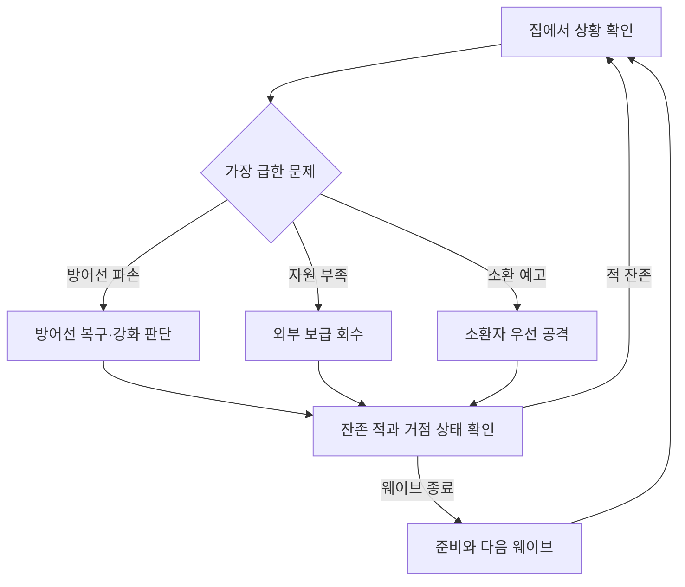
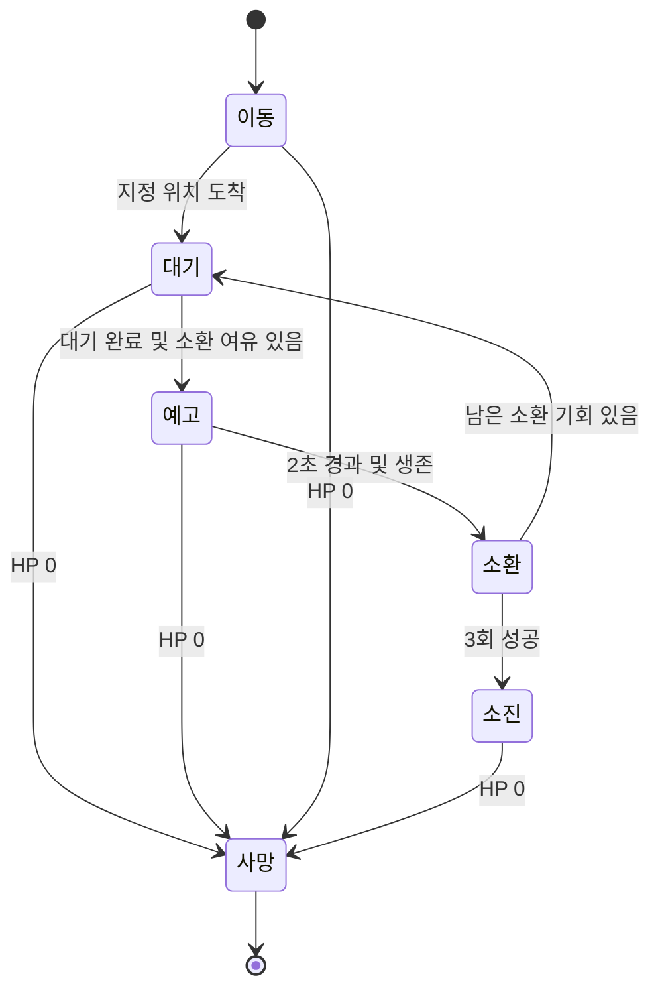
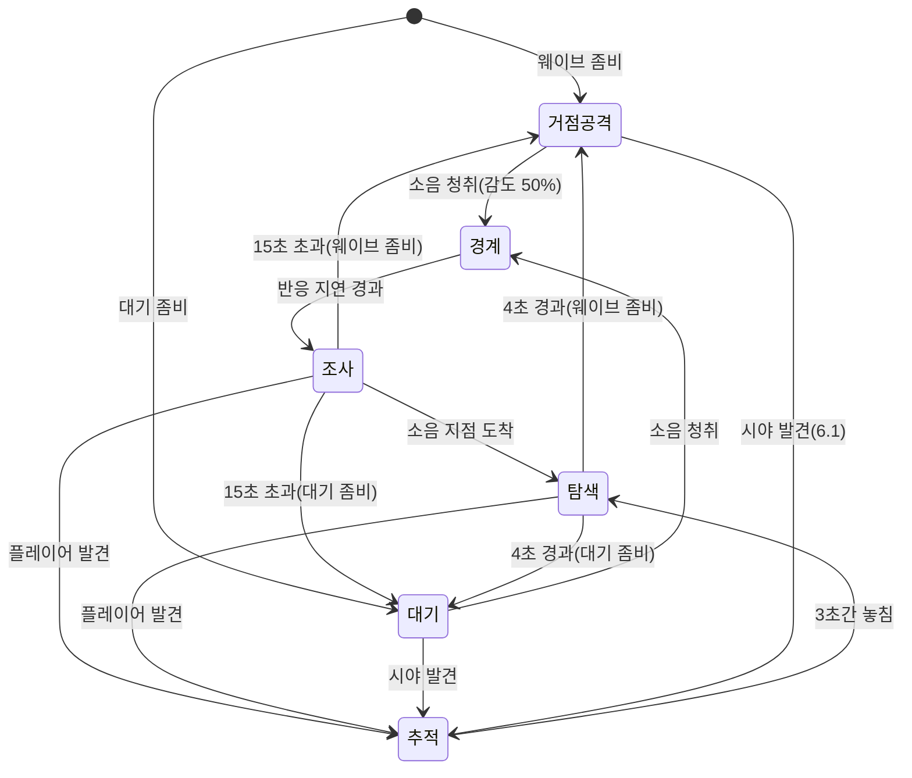

# TPS 좀비 서바이벌 상세 기획서

버전: v0.8 / 작성일: 2026-09-16 / 수정일: 2026-10-06 / 상태: 프로토타입 설계 초안

기반 자료: 「TPS 게임 기본 구상 (2장 요약)」 및 사용자가 추가한 일반 좀비·소환형 특수 좀비 구상. 기존 요약본을 바탕으로 작성한 별도의 확장 문서다.

## 0. 구현 기준과 확장안의 구분 (v0.8)

이 문서의 현재 동작은 아래 코드·저장된 데이터 확인표를 기준으로 한다. 이후 장의 준비·거점·특수 적·소음·도전 수치는 구현할 확장안이며 현재 동작이 아니다. C# 필드 기본값, 데이터 에셋 값, 프리팹·씬 직렬화 값, 실제 실행 결과를 구분한다. 이번 확인은 파일 검사이며 Unity Play Mode는 미실행이다. 사용자 요청으로 현재 코드를 기준선으로 삼았으며, 확장 기능을 삭제하거나 구현했다고 간주하지 않는다.

| 영역 | 확인한 현재 구현 | 근거·한계 |
|---|---|---|
| 웨이브 | 번호를 1 증가 후 `Mathf.RoundToInt(wave * 1.5f)`마리 일괄 생성. 등록된 살아 있는 좀비 0이면 즉시 다음 웨이브 | `Assets/Scripts/Zombie/ZombieSpawner.cs`. 준비·대기열·생존 상한·5웨이브 승리·빅웨이브 분기 없음 |
| 적 스펙 선택 | 좀비 프리팹과 ZombieData를 각각 독립 무작위 선택 | 프리팹 외형으로 HP·공격력·속도를 고정할 수 없음. 실제 배열 연결 확인 필요 |
| ZombieData | Default 및 Data: HP 100·피해 20·속도 2. Fast: 50·10·4. Heavy: 250·50·1 | `Assets/ScriptableData/Zombie*.asset`. 실제 출현 비율은 씬 연결에 따라 달라짐 |
| 공격 간격 | 스크립트 기본 1초, 저장된 좀비 프리팹에는 0.5초 또는 1초 | `Zombie.Setup`이 피해·HP·속도를 데이터에서 덮어씀. C# 기본 피해 20을 전체 적의 확정 피해로 보지 않음 |
| 탐지·목표 | 대상이 없으면 정지하고 0.25초마다 20m 구 안 살아 있는 LivingEntity를 찾음. 바리케이드는 탐지 후보에서 제외 | `Zombie.cs`. 시야 기반 8m 탐지·3초 놓침·활성 거점 기본 공격은 미구현 |
| 소환자 | `CrowZombie`: 귀속 적이 0이면 0~2마리 무작위 생성, 생성된 적은 주 스포너에도 등록 | 횟수·간격·예고·전체 상한 없음. 플래그가 즉시 false로 돌아가 귀속 적 전멸 후 반복 가능. 0마리 추첨 시 다음 FixedUpdate에서 다시 시도. 3회·최대 6마리는 향후안 |
| 총기 | Rifle 데이터 에셋: 피해 35, 탄창 25, 시작 예비탄 100, 발사 간격 0.12초, 재장전 1.8초 | `Gun Data.asset`, `Gun.cs`. 다른 무기는 별도 데이터. 에셋 연결을 확인하기 전 모든 무기의 공통값으로 보지 않음 |
| 탄약·머리 명중 | 탄약 획득은 주무기 예비탄 증가. 일반 Gun 경로에 머리·급소 추가 배율 없음 | 예비탄 120 상한 없음 (`int.MaxValue`까지 증가). 헤드샷·급소 도전은 해당 피격 판정 구현 후 적용 |
| 이동 | 기본 이동 5m/s, 달리기 배율 2. 조준 여부에 따른 별도 속도 감소 없음 | `PlayerMovement.cs` 및 저장된 PlayerCharacter 프리팹. 4.5/2.5와 추적 2.2는 미적용 제안 |
| 보급 | 유효 아이템 목록 중 동일 확률로 1개 선택. 플레이어 근처 NavMesh 샘플링. 5초 뒤 제거 | ItemSpawner 기본·Game 씬 확인: 간격 2~7초, 샘플링 거리 5. 샘플 보정 후 실제 거리는 5m 초과 가능. 30초 4묶음·45/25/30 가중치·탄약 최소 보장·구역 차등은 미구현 |
| 회복 | HealthPack의 회복량 기본 50, 획득 사용 시 즉시 회복 후 픽업 제거 | 회복약 보유 3개·Q 사용·1.5초 작업은 확장안 |
| 바리케이드 | 초기 판자 0, E 1회로 한 조각 설치 작업. 조각 HP 기본 20, 작업 기본 1.5초, 완료 시 재료 1개 소비 | `Barricade`, `BarricadeBuilder`. 5소켓이면 최대 100. 피격당 최소 1조각, ceil(피해/20)조각 제거. 자동 설치·단계 강화는 미구현 |
| 판자 | PlankInventory 기본 상한 30 | 기획의 10개와 구분. 씬·프리팹 override는 별도 |
| 패배 | 플레이어 사망 시 GameManager.EndGame | 거점 보관소 HP 500과 파괴 패배·거점 자동 변경은 미구현 |

저장된 `Spawn Points.prefab`의 zombiePrefab 항목 3개는 null로 확인됐다. Game 씬에는 해당 프리팹 인스턴스가 있으므로 Unity에서 실제 연결·활성 상태를 확인해야 한다. 이 파일 검사만으로 현재 씬의 정상 스폰이나 실제 출현 비율을 확인했다고 표시하지 않는다.

## 1. 결정 상태와 기획 목표

**한 줄 콘셉트:** 집을 지키기 위해 밖에서 보급품을 모으고, 좀비를 증원하는 특수 개체를 처치할 시점을 판단하는 거점 방어 슈팅 게임.

| 구분 | 내용 |
|---|---|
| 사용자 구상 | 일반 좀비와 주변에 일반 좀비를 생성하는 특수 좀비, 두 종류를 웨이브에 활용 |
| 사용자 추가 요청 (2026-10-06) | 10웨이브마다 대규모 좀비를 생성하는 빅웨이브, 전투 전 준비 시간, TMPro 알림 |
| 사용자 추가 구상 (2026-10-06) | 기본 바리케이드 자동 설치와 설치 모션, 기존 바리케이드 아이템의 강화 재료 전환, 폭발형·탱킹형·딜링형 특수 좀비 추가 |
| 사용자 도전 구상 (2026-10-06) | 1~5웨이브에는 도전 없음. 6웨이브부터 좀비 N마리 처치, 헤드샷 또는 급소 N회 명중, 특수 좀비 제한 시간 내 처치, 능력 사용 전 처치 |
| 사용자 동선 구상 (2026-10-06) | 바리케이드 방어와 별개로 플레이어만 자유롭게 왕복 가능한 출입 루트 제공. 외부 파밍과 귀환을 유도 |
| 사용자 거점 구상 (2026-10-06) | 집 6채를 활용해 맵을 확장·장식. 플레이어의 방어 투자·체류에 따라 거점 자동 변경. 보급 확률과 좀비의 거점 공격 목표도 새 거점을 따름 |
| 사용자 방향 (소음, 2026-10-06) | 좀보이드식 소음 시스템 도입. 현재 좀비는 범위 안에서 플레이어를 찾지 못하면 IDLE로 멈춰 있으므로 소리로 좀비를 간접 유인한다. 대기 좀비·소음원·청취 규칙은 6.5 |
| 사용자 요청 (수치, 2026-10-06) | 웨이브 수치를 하나의 공식으로 통합(7.0), 전투 난이도 시뮬레이션과 조정 수치 제안(6.4) |
| 기존 요약본 유지 | TPS 조작, 중앙 하우스와 외부 필드, 외곽 생성 지점, 30초 보급 주기, 바리케이드 3단계 |
| 기존 수치 유지 | 탄약 확률 45%·30발·한도 120발, 회복약 25%·체력 50% 회복·한도 3개, 판자 30%·한도 10개 |
| 변경 제안 | 무한 적 생성을 유한한 5개 웨이브 프로토타입으로 우선 검증. 적 체력의 시간 비례 증가는 우선 보류 |
| 신규 제안 | 거점 보관소 내구도, 준비 시간, 소환 횟수 제한, 보급 개수·최소 보장, 조작과 상세 수치 |
| 미정 | 최종 플랫폼, 엔진, 팀 규모·일정, 최종 시점 변경 여부, 아트, 판매 방식, 무한 모드 채택 |

**아래에서 별도로 ‘기존’ 또는 ‘사용자 구상’이라고 표시하지 않은 규칙과 수치는 모두 검증용 제안이다. 승인된 최종 사양이나 플레이 테스트 결과가 아니다.** 구현 기준을 일관되게 만들기 위해 프로토타입은 PC 키보드·마우스, 싱글플레이 TPS로 가정한다.

목표 경험은 ‘지금 수리할지, 보급하러 갈지, 소환자를 먼저 제거할지’를 판단하는 것이다. 숙련자는 조준 정확도뿐 아니라 외출 경로, 귀환 시점, 탄약 소비, 소환 차단 시점을 최적화한다.

핵심 검증 가설: 소환형 좀비가 등장하면 플레이어의 행동이 단순한 문 앞 사격에서 우선순위 판단으로 바뀌는가? 거점을 완전히 포기하거나 실내에만 머무는 한 가지 전략이 항상 유리하지 않은가?

## 2. 플레이 범위와 종료 조건

| 항목 | 프로토타입 제안 |
|---|---|
| 목표 | 5번째 웨이브까지 생존하며 보관소 보호 |
| 승리 | 마지막 웨이브의 예정 생성 완료 및 모든 살아 있는 적 제거 |
| 패배 | 플레이어 HP 또는 보관소 내구도 0 |
| 한 판 | 약 10~15분을 검증 목표로 설정. 현행에는 고정 5웨이브 종료·준비·분산 생성이 없어 현재 판 길이로 검증되지 않음 |
| 시작 자원 | 장전 30발, 예비탄 90발, 회복약 1개, 판자 4개 |
| 초기 방어 | 입구 2곳·창문 2곳, 각각 1단계 바리케이드 설치 |
| 판 사이 | 성장·아이템 이월 없음. 클리어 시간과 받은 피해를 기록 |
| 초기 5웨이브 검증안의 제외 범위 | 멀티플레이, 보스, 추가 좀비 종, 무기 제작, 스킬 트리, 영구 성장, 온라인 랭킹. 추가 좀비 3종은 6.3의 확장 구상으로 별도 관리 |

보관소 내구도는 원문에 없는 추가안이다. 집을 버리고 계속 달아나는 전략에도 대가를 주기 위한 장치다. 채택하지 않는다면 거점의 필요성을 별도로 재설계해야 한다. 이 초안에서는 보관소를 공격 가능한 거점 목표물로 사용하며, 별도 보관 인벤토리 UI는 만들지 않는다.

## 3. 핵심 루프와 정보

| 시간 규모 | 행동과 반응 | 보상·다음 판단 |
|---|---|---|
| 수 초 | 조준·사격으로 접근 적 제거, 공격 예고를 보고 이동 | 통로 확보, 탄약 소모와 거리 유지 판단 |
| 수십 초 | 집의 상태를 확인하고 보급품 회수 또는 소환자 처치 | 탄약·판자 확보, 향후 증원 감소 |
| 한 웨이브 | 전투·수리·외출을 병행한 뒤 잔존 적 정리 | 준비 시간 확보, 다음 공격 방향에 맞춰 재정비 |
| 한 판 | 일반 적 대응 학습 후 소환자·다방향 공격 해결 | 클리어, 시간·피해 기록 비교 |

일일 과제나 장기 성장 루프는 현재 범위에 포함하지 않는다. 먼저 같은 맵과 두 적만으로 다시 플레이할 이유가 생기는지 확인한다.

## 4. 맵과 거점

| 구역 | 구성 | 플레이 의도 |
|---|---|---|
| 중앙 | 단층 하우스, 보관소, 네 방어 지점 | 익숙한 귀환 지점과 공격 방향 판단 기준 |
| 근거리 필드 | 집 둘레 이동로, 일부 보급 지점 | 짧게 나가 소량 회수하는 선택 |
| 원거리 필드 | 엄폐물과 보급 지점, 귀환 우회로 | 더 멀리 이동하며 적을 피하는 위험 |
| 외곽 | 안개와 방향별 적 생성 지점 | 공격 방향 예고와 적 유입 |

제안 블록아웃: 플레이 가능 구역 약 60×60m, 집 약 10×10m. 집 중심에서 8~15m에 가까운 보급, 18~25m에 먼 보급 지점을 둔다. 외곽은 이동 불가 경계로 표시한다. 수치는 이동 시간과 실내 카메라 테스트 후 변경한다.

바리케이드로 막는 좀비 진입로와 플레이어의 외출·귀환 루트를 구분한다. 창문은 플레이어가 통과하지 못하지만 파괴 후 좀비가 침입할 수 있다. 플레이어 전용 출입 루트는 바리케이드 설치·강화·파괴 상태와 관계없이 왕복 가능하며, 외출을 위해 방어선을 해제하거나 판자를 소모하지 않는다. 출입 판정과 공간 표현은 4.1의 초안에 따른다.

소환자가 집 뒤 장애물에 가려져 대응 불가능해지지 않도록 외부 사격 위치를 최소 두 곳 확보한다. 모든 소환 대기 지점에서 보관소까지 일반 좀비의 이동 경로가 있어야 한다.

대기 좀비 군집은 미구현 확장안이다. 거점 중심 25~29m는 배치 후보이며 창가·출입구 등 실제 사격 위치에서의 거리를 검사해야 한다. 거점 이동 후 기존 군집은 유지되므로 창가 사격으로 절대 깨지 않는다고 보장하지 않는다. 이동 거점과 집 6채·확장 맵에 맞춰 경계·원거리 보급 위치를 재검증한다.

### 4.1 플레이어 전용 출입로와 외부 파밍

**사용자 방향:** 집 안에서 방어하면서도 외부 파밍을 위해 자유롭게 나갈 수 있게 한다. 플레이어만 통과할 수 있는 루트를 제공하고 좀비는 기존 진입로의 바리케이드를 공격하거나 파괴된 통로로 침입한다. 자유로운 출입은 피해 면역이나 필드의 안전 보장을 뜻하지 않는다.

**공간 초안:** 집의 서로 다른 면에 플레이어 전용 측면 출입구 2곳을 배치해 한쪽에 적이 몰리면 다른 쪽으로 귀환할 수 있게 한다. 두 곳이라는 수와 구조는 블록아웃 테스트 제안이다. 방어 판자를 관통해 걷는 표현보다 별도 측문·통로로 명확히 보여 주고, 과도하게 좁거나 번거로운 점프·긴 상호작용이 없는 이동 루트를 우선한다. 출입구 아이콘·바닥 유도 표시로 구분한다. 구체적인 장치 외형과 통과 연출은 미정이다.

| 동선 | 배치·규칙 초안 | 플레이 의도 |
|---|---|---|
| 출입구 → 근거리 보급 → 귀환 | 가까운 보급을 알아보기 쉽게 배치. 기본 탄약·회복 후보 제공 | 짧은 외출로 재정비 |
| 출입구 → 원거리 파밍 → 반대편 귀환 | 엄폐물과 연결된 우회로, 강화 재료·무기 후보 배치 | 더 오래 외출할지, 방어선으로 복귀할지 판단 |
| 외부 → 방어선 확인 → 실내 복귀 | 귀환 중 거점 피해·바리케이드 상태를 UI로 확인 | 외출의 이득과 거점 압박 비교 |

강화 재료와 무기 획득 기회를 외부에 두어 출입로를 사용할 이유를 만든다. 원거리 보상의 종류·수량은 조정안이며 기존 보급 확률·무기 주기·소지 상한을 조용히 변경하지 않는다. 실내에 모든 자원이 자동 지급돼 외출이 불필요해지지 않게 하되, 필수 탄약이 원거리에만 있어 반드시 장거리 파밍을 해야 하는 구조도 피한다. 플레이어가 밖에 있는 동안 좀비의 거점 공격은 계속된다.

**이동·전투 판정:** 일반·소환자·폭발형·탱킹형·딜링형 모두 전용 루트로 집 안팎을 통과할 수 없다. 좀비는 전용 통로를 유효한 NavMesh 진입 경로로 선택하지 않으며 플레이어가 통과했을 때 막힌 통로에서 추적을 무한 반복하지 않고 다른 목표·진입 경로를 재선택한다. 물리 충돌과 AI 경로 판정이 일치해야 한다. 플레이어를 통과시키기 위해 바리케이드의 전체 충돌을 일시 해제하지 않는다. 출입구를 통과한다고 피격 무적을 부여하지 않으며 공격·폭발·사격은 기존 거리·시야·차단물 판정을 따른다.

**준비 시간 연계:** 빅웨이브 전 20초에는 무기·보급 회수 후 귀환할 수 있다. 실제 왕복 이동 시간에 획득·재장전·강화 시간을 더해 준비 시간의 적정성을 검증한다. 준비 종료 시 강제 귀환·순간이동은 없으며 밖에 남아 있는 선택도 가능하다. 실내외 체류 시간, 파밍 회수량, 외출 중 거점 피해와 출입구 부근 적 정체를 관찰한다.

### 4.2 이동 가능한 거점과 보급·좀비 목표 전환

**사용자 방향:** 현재 맵 에셋의 집 6채를 활용하고 맵을 확장한다. 거점을 한 집에 고정하지 않으며 다른 집의 바리케이드 설치·방어 투자나 플레이어 체류가 늘면 자동 전환할 수 있게 한다. 거점 변경 시 보급 확률과 좀비의 공격 목표를 새 집에 맞춰 함께 변경한다. 다음은 판정·전환의 설계 초안이며 코드 구현이나 확률 확정을 뜻하지 않는다.

**거점 후보 판정 제안:** 기본 자동 설치 개수는 플레이어의 투자와 구분한다. 집마다 바리케이드 지점 수가 다를 수 있으므로 강화 투자·유효 방어 비율과 최근 실내 체류 시간을 함께 평가한다. 전체 누적 체류가 아닌 최근 일정 구간을 사용한다. 단순히 파밍하러 잠깐 들어간 집이 거점으로 바뀌지 않도록 최소 체류·방어 투자 조건과 후보 유지 시간을 둔다. 가중치·조건 결합 방식·시간·점수 차이는 미정이다. 사용자 구상의 단일 조건 전환과 복합 조건 판정 중 최종 방식은 테스트 후 결정한다.

**전환 흐름 제안:** 후보 감지 → UI로 정착 예고 → 조건 유지 → 변경 가능 단계에서 새 거점 확정. 취소 입력과 전환 후 재변경 대기시간을 제공하는 것을 제안한다. 초기안은 준비 단계에서 확정하고 빅웨이브 전투 중에는 보류한다. 일반 전투 중 허용 여부·준비 단계가 없는 웨이브의 확정 시점은 미정이다. 후보를 감지한 것만으로 보급이나 공격 목표를 먼저 바꾸지 않는다.

| 시스템 | 거점 확정 시 동작 | 유지·예외 규칙 |
|---|---|---|
| 현재 거점 | 새 집 ID를 활성 거점으로 지정하고 이전 집은 파밍 구역으로 전환 | 한 시점에 활성 거점은 한 곳 |
| 보급 확률 | 새 거점 실내는 낮은 생성 확률, 이전 거점과 다른 파밍 집·외부는 높은 확률 적용 | 실제 확률·생성량·아이템 구성은 조정값. 구역별 확률을 아이템 종류의 기존 추첨 비율과 구분 |
| 기존 필드 아이템 | 현재 위치·잔량·소멸 시간을 유지 | 즉시 제거·재추첨·보충하지 않음. 바뀐 구역 설정은 다음 생성 판정부터 적용 |
| 거점 공격 AI | 새 집의 거점 목표물·진입로·바리케이드로 목표 갱신 및 경로 재계산 | 적을 순간이동시키거나 수·HP를 초기화하지 않음. 경로 갱신은 프레임별로 분산 |
| 플레이어 추적 AI | 기존 플레이어 추적 규칙 유지, 거점 공격 복귀 시 새 집 사용 | 모든 좀비가 플레이어를 무시하고 새 집으로만 달려가지는 않음 |
| 새 적 생성 | 생성 후 새 거점을 참조 | 스폰 지점 자체를 새 집 주변으로 옮기는 규칙은 별도 미정 |
| 집별 방어선 | 기존 설치·강화·손상 상태 유지 | 거점 변경만으로 무료 설치·복구·강화하지 않음 |
| UI | 새 거점 이름·방향·상태와 변경 알림 표시 | 파밍 구역과 새 거점을 식별 가능하게 함 |

보급 확률 변화는 기존의 단순 실내·실외 구분 대신 활성 거점 여부를 기준으로 적용한다. 다른 집 실내도 외부 파밍 구역으로 취급한다. 거점 실내에는 최소한의 기본 보급을 남기고 외출로 더 많은 자원을 얻는 구조를 목표로 한다. 새 집의 전용 출입로는 4.1과 같은 플레이어 전용 통과 규칙을 충족해야 한다.

**좀비별 적용:** 일반·탱킹형과 바리케이드를 목표로 하는 폭발형은 새 거점의 방어 경로를 선택한다. 딜링형의 플레이어 우선 추적은 유지한다. 소환자는 새 거점에 대응하는 유효 외곽 대기 지점을 선택하도록 설계하되, 진행 중 소환 예고는 기존 예약 위치의 유효성으로 처리하고 다음 이동·소환 기회부터 새 거점을 사용한다. 이미 소환된 좀비는 제거하지 않는다. 기존 공격이 시작됐다면 실제 타격 시 거리·차단물·대상 생존을 재검사하고 다음 행동부터 새 목표를 선택한다. 변경된 거점 위치로 진행 중 공격·폭발을 옮기지 않는다.

**목표·내구도 제안:** 각 후보 집에 유효한 거점 목표물과 진입 경로를 정의한다. 보관소 내구도가 패배 조건인 모드에서는 전환으로 피해를 초기화하지 않도록 세션 거점 내구도를 공유하고 새 목표물에 연결하는 것을 제안한다. 집별 내구도·물자 실제 운반 여부는 별도 결정이다. 현재 도전의 지정 특수 적이나 이미 확정된 대상 ID는 거점 변경 때문에 다시 뽑지 않으며 제한 시간·진행도도 초기화하지 않는다.

**전환 안전성:** 유효 목표물·경로·전용 출입로가 없는 집은 후보에서 제외한다. 활성 거점 ID 확정과 보급·AI·UI 통지를 하나의 전환으로 처리해 새 집 확률과 이전 집 공격 목표가 섞이지 않게 한다. 게임오버가 겹치면 거점 전환보다 패배 처리를 우선한다. 재시작 시 후보 점수·타이머·이벤트와 현재 거점 정보를 해당 판의 초기 상태로 되돌린다.

## 5. 플레이어 조작·전투 (확장안)

| 입력 | 기능 | 조건 |
|---|---|---|
| WASD / 마우스 | 이동 / 카메라 회전 | 메뉴·결과 화면에서는 비활성 |
| 우클릭 / 좌클릭 | 조준 / 발사 | 사격은 장전·수리·회복 중 불가 |
| R | 재장전 | 예비탄이 있고 탄창이 가득 차지 않았을 때 |
| E | 아이템 획득, 바리케이드 수리 | 대상과 2m 이내, 시야 차단 없음 |
| G 길게 | 바리케이드 단계 강화 | 자원·단계 조건 충족 |
| Q | 회복약 사용 | HP가 최대 미만이고 회복약 보유 |
| Esc | 일시정지 | 모든 게임 시간과 생성 타이머 정지 |

| 기본 값 | 제안 |
|---|---:|
| 플레이어 HP | 100 |
| 이동 속도 / 조준 이동 속도 | 4.5 / 2.5 m/s (v0.7 조정, 이전 5 / 3) |
| 총기 | 소총 1종, 즉시 명중 판정 |
| 몸통 피해 / 머리 배율 | 20 / 2.0배 (v0.7 조정, 이전 1.5배. 머리 40 피해) |
| 발사 간격 / 재장전 | 0.25초 / 2초 (v0.7 조정, 이전 0.2초) |
| 탄창 / 예비탄 최대 | 30 / 120발 |
| 회복약 사용 시간 | 1.5초 |
| 보관소 내구도 | 500, 이번 판 수리 불가 |

기존 ‘120발’은 이 초안에서 예비탄 한도로 해석한다. 탄창 포함 총 한도 120발을 의도했다면 변경해야 한다. 회복량은 최대 HP의 50%, 초과분은 버린다. 회복 완료 시 약을 소모하며 피격·사격·수리 입력으로 중단하면 소모하지 않는다. 재장전 완료 시에만 탄창으로 이전하며 중단하면 이전하지 않는다.

카메라 조준점으로 목표를 구하되 총구와 목표 사이 장애물을 다시 검사한다. 벽 뒤에서 카메라만 내밀어 발사하는 상황을 방지한다. 창문 사격 틈은 플레이어와 좀비의 충돌 판정에서 일관되게 보인다. 실내 벽에 카메라가 가까워지면 카메라 거리를 줄인다.

## 6. 적 역할: 기존 2종과 특수 좀비 확장 구상

6.1·6.2의 상태·소환 횟수·스펙은 향후안이다. 현재 Zombie/CrowZombie 동작은 0장과 6.4를 기준으로 하며 이 장의 수치를 현재 설정으로 간주하지 않는다.

| 구분 | 일반 좀비 | 소환형 특수 좀비: 가칭 소환자 |
|---|---|---|
| 목적 | 접근·침입으로 즉시 방어 압박 | 방치하면 일반 좀비가 늘어나는 미래 압박 |
| 주요 행동 | 이동, 근접 공격, 바리케이드 파괴 | 외부 위치 확보, 예고 후 주변 일반 좀비 생성 |
| 요구 판단 | 어느 통로를 먼저 막을지 | 현재 전선을 지킬지 소환자를 제거할지 |
| HP / 이동 속도 | 80 / 1.8m/s, 플레이어 발견 후 추적 2.2m/s (v0.7 조정, 이전 60) | 240 / 1.2m/s (v0.7 조정, 이전 160) |
| 공격 | 10 피해, 1.5초 간격 | 직접 공격 없음 |
| 식별 | 앞으로 기운 실루엣, 근거리 신음 | 큰 상체, 상승한 팔, 고유 소환음 |
| 처치 보상 | 위협 제거, 자원 드롭 없음 | 남은 소환 차단, 자원 드롭 없음 |

두 적은 체력만 다른 관계가 아니라 즉시 피해와 증원이라는 다른 문제를 만든다. 소환자는 무조건 최우선 정답이 되지 않도록 등장 시점·위치를 바꾸되, 초기에는 한 마리만 등장시켜 역할을 학습하게 한다.

### 6.1 일반 좀비 행동 규칙

1. 8m 이내에서 플레이어를 보고 도달 가능한 경로가 있으면 추적한다. 추적 중 이동 속도 2.2m/s는 미적용 조정 후보다. 현행은 ZombieData의 단일 속도를 사용한다.
2. 플레이어를 놓친 뒤 3초 동안 마지막 위치로 이동하고 다시 발견하지 못하면 거점 공격으로 복귀한다. 대기 좀비(6.5)는 대기로 복귀한다.
3. 기본 목표는 현재 활성 거점의 보관소다. 보관소로 통하는 열린 진입로가 있으면 진입하고, 없으면 경로 비용이 가장 낮은 바리케이드로 이동한다. 거점 변경 시 4.2의 규칙으로 목표와 경로를 갱신한다.
4. 선택한 경로가 막히거나 현재 목표가 파괴되면 다시 경로를 계산한다. 목표 선택은 0.5초 간격으로 제한하고 현재 목표를 우선해 왕복을 줄인다.
5. 1.2m 이내에서 0.4초 공격 예고 후 타격한다. 타격 시 거리와 차단물을 다시 검사해 벽 너머 피해를 방지한다.
6. 플레이어에게 피해를 받으면 8m 이내이고 추적 가능한 경우 플레이어로 목표를 바꾼다. 나머지 개체는 거점 압박을 계속한다.
7. 소음을 들으면 6.5의 청취·반응 규칙에 따라 소음 지점을 조사한다. 조사·탐색 중에도 1번 조건을 만족하면 즉시 추적한다.

동일 대상에 여러 적이 동시에 공격할 수 있다. 플레이어 피격 무적은 우선 넣지 않으며, 겹침으로 즉사하는 문제가 있으면 공격 자리 수와 적 충돌부터 조정한다. 공격 자리 포화 시 대기하거나 다른 진입로를 탐색한다.

### 6.2 소환자 행동과 상태

소환자는 집 외부의 지정 대기 지점으로 이동한다. 지점은 집 중심에서 약 12~20m 거리에 배치하고 소환 가능한 공간과 접근 경로를 사전 검증한다. 자동 도주·회복·원거리 공격은 구현하지 않는다.

| 소환 항목 | 제안 규칙 |
|---|---|
| 첫 소환 | 대기 지점 도착 후 4초 대기하고 예고 시작 |
| 예고 | 2초간 팔 동작·고유음·바닥 표시. 그동안 이동하지 않음 |
| 반복 | 성공한 소환 완료 후 12초 대기하고 다음 예고 시작 |
| 생성 수 | 1회 최대 일반 좀비 2마리 |
| 범위 | 소환자 기준 수평 거리 2~4m의 고리 영역 |
| 누적 횟수 | 한 소환자당 성공 소환 3회, 최대 6마리 |
| 귀속 생존 상한 | 한 소환자가 생성한 살아 있는 일반 좀비 최대 4마리 |
| 전체 생존 상한 | 일반·소환자·대기·신규 특수 적 합계 30마리: 미구현 제안 |
| 중단 | 예고 중 소환자 사망 시 취소. 일반 피격은 취소하지 않음 |
| 소환자 사망 후 | 이미 생성한 일반 좀비는 남아 전투 지속 |
| 소진 후 | 고유 효과를 끄고 제자리 대기. 자동 사망하지 않음 |

**소환 위치 검사:** 이동 가능 바닥, 캡슐 충돌 없음, 보관소까지 이동 경로 존재, 집 실내 아님, 플레이어와 3m 이상, 생성 예정 위치끼리 겹침 없음. 유효 위치를 확보한 뒤 예고 표시를 띄우고 완료 시 다시 검사한다. 생성 직후 0.8초는 이동·공격 없이 출현 연출을 진행하며 피해는 받을 수 있다.

한 슬롯만 유효하면 1마리만 생성하고 성공 횟수를 1회 소모한다. 둘 다 실패하면 횟수를 소모하지 않고 3초 후 다시 시도한다. 전체 또는 귀속 상한에 막혀도 같은 재시도 규칙을 쓴다. 취소·실패한 예고 표시는 즉시 제거한다. 개체별로 상한 슬롯을 예약해 동시 완료 시 30마리를 초과하지 않게 한다. 예정 웨이브 생성이 대기 중이면 예정 생성에 슬롯 우선권을 준다.

소환 횟수를 모두 쓴 개체도 웨이브 종료 전 처치해야 한다. 고유 표시를 변경해 더 이상 소환하지 않는다는 사실을 알려주고, 잔존 적 안내로 위치를 찾을 수 있게 한다. 소환 한도가 긴장감을 너무 약하게 만들면 무제한화에 앞서 횟수와 간격을 각각 실험한다.

### 6.3 신규 특수 좀비 3종: 폭발·탱킹·딜링

사용자가 추가 구상한 세 역할을 기존 일반 좀비·소환자와 구분한다. 아래 행동·약점·연출은 설계 제안이며 등장 웨이브, 비율, HP, 피해, 속도, 재사용 대기시간은 미정이다. 초기 5웨이브 표에 자동으로 추가하거나 빅웨이브에 전부 등장시키지 않는다.

| 역할·가칭 | 전투 목적 | 행동 제안 | 예고·식별 | 대응 방법 |
|---|---|---|---|---|
| 폭발형: 자폭 좀비 | 한 지점에 머무르거나 방어선에 밀집한 플레이를 흔듦 | 플레이어 또는 바리케이드에 접근 후 멈춰 폭발 준비. 예고 종료 시 범위 피해 | 부풀어 오른 몸, 점멸·기폭음, 폭발 범위 표시 | 예고 중 거리 확보 또는 먼저 처치 |
| 탱킹형: 중장갑 좀비 | 공격을 받아내며 일반 좀비가 접근할 시간을 만듦 | 느리게 전진하며 방어선에 지속 압박. 높은 생존력과 노출 약점 | 큰 실루엣, 장갑, 무거운 발소리. 약점 명확히 표시 | 약점 사격 또는 이동으로 유도해 다른 위협부터 처리 |
| 딜링형: 강습 좀비 | 플레이어에게 즉각적인 피해 위협을 만듦 | 플레이어를 우선 추적하며 짧은 접근·공격 예고 후 강한 근접 공격. 공격 후 회복 시간 | 날렵한 실루엣, 고유 접근음, 공격 준비 자세 | 접근 전에 우선 처치하거나 공격을 회피한 뒤 반격 |

폭발형의 조기 처치는 기폭을 취소하고 사망 후 피해 폭발은 발생하지 않는 것을 초기안으로 둔다. 폭발 시 플레이어·바리케이드·보관소는 반경과 차단물을 검사하고 각 대상에 한 번만 피해를 적용한다. 다른 좀비에 대한 폭발 피해는 미정이다. 폭발 후 해당 개체는 한 번만 사망 처리하며 잔존 수와 점수도 중복 처리하지 않는다.

탱킹형은 체력만 늘려 탄약 소모를 강제하지 않도록 약점 공략을 제공한다. 딜링형은 높은 공격력과 빠른 접근을 모두 과도하게 올리지 않고 공격 예고·회복 시간으로 반격 기회를 보장한다. 원거리 공격, 다른 적 보호 오라, 연쇄 폭발은 이번 기본 구상에 포함하지 않는다.

등장은 한 종류씩 학습시킨 뒤 조합한다. 빅웨이브의 기본 정체성은 물량전이며 특수 적 편성은 후속안이다. 편성 시 특수 적을 빅웨이브 예정 총수에 포함하고 전체 생존 상한을 공유하며, 총수에 더해 무제한으로 추가하지 않는다. 여러 역할이 동시에 등장해 예고가 묻히거나 회피가 불가능해지는 조합은 별도로 검증한다.

### 6.4 현재 코드 기준의 수치 검산과 한계 (v0.8)

이전 v0.7 계산은 기획 HP 80/240·몸통 20·머리 2배·30발 탄창·30초 보급을 가정했다. 현재 구현과 달라 처치 시간·탄약 수지·바리케이드 유지 시간·한 판 길이의 확정 근거로 사용하지 않는다. 해당 가정의 565~770발 및 7~8분 추정은 보류한다. 현재 동작은 0장의 데이터와 코드가 기준이다.

**예시 검산:** Rifle 에셋 피해 35가 그대로 적용되면 Default HP 100은 3회, Fast HP 50은 2회, Heavy HP 250은 8회 유효 명중으로 처치한다. 머리 배율은 적용하지 않는다. 명중률 60% 가정 시 기대 발사 수는 각각 5발·약 3.33발·약 13.33발이다. 실제 전투에서는 무기·데이터 선택, 사거리·피격 대상·특수 공격에 따라 달라진다. 명중률은 관측 결과가 아닌 계산 가정이다.

바리케이드는 연속 HP 감소가 아닌 판자 제거 방식이다. 기본 20 HP 판자 5개라면 피해 10 또는 20은 타격당 1개, 피해 50은 3개를 제거한다. 완성 방어선은 각각 유효 타격 5회 또는 2회로 파괴된다. 공격 간격과 첫 타격 시점·공격 애니메이션·접근 시간에 따라 실제 시간이 달라진다. 기존 150/250/400 내구도의 20/26/32초 계산은 현재 구현에 적용하지 않는다.

현재 일반 스폰의 1~5웨이브 예정 수는 2/3/4/6/8, 합계 23마리다. 소환자 출현과 반복 소환이 있으면 전체 처치 수는 이 합계를 초과하며 최대 증원 수가 제한되지 않아 고정 상한 탄약 계산이 불가능하다. 적 데이터와 프리팹을 독립 선택하므로 정확한 탄약 수지는 실제 연결과 출현 비율·명중률을 확인한 뒤 계산한다.

빅웨이브 밸런스는 7.0의 코드 기반 물량으로 다시 검증한다. 예정 일반 수·소환자 수·소환 최대 증원 수·전투 시간·보급 회수량을 각각 기록하고 일반 물량만을 전체 필요 탄약으로 부르지 않는다. 소환 횟수 제한을 구현하기 전에는 최대 증원 탄약을 유한한 값으로 확정하지 않는다. 추가 탄약 상자 2개나 36발 보급 제안은 보류하며 현행 보급 구조·구역별 변경안과 함께 재산정한다.

현재 이동도 기본 5·달리기 10이고 Fast 데이터 속도는 4다. 조준 이동 2.5가 추적 2.2보다 빠른 이전 제안은 후퇴 사격 이득을 제거하지 못한다. 속도·HP·연사 간격 조정은 실측 없이 난이도가 해결됐다고 표현하지 않는다.

### 6.5 소음 시스템과 대기 좀비 (좀보이드 참고, v0.7)

**사용자 방향:** 프로젝트 좀보이드의 소음 개념을 도입한다. 플레이어가 내는 소리로 좀비를 간접 유인한다. 아래 수치·상태·배치는 모두 테스트 시작값이며 확정 사양이 아니다. 코드 구현은 포함하지 않는다.

**코드 확인 (`Zombie.cs`):** 현재 좀비는 명시적 상태 enum 없이 두 갈래로 동작한다. 추적 대상이 있으면 NavMesh로 접근하고, 없으면 이동을 멈추고(IDLE) 0.25초마다 반경 20m 구(`OverlapSphere`)에서 `whatIsTarget` 레이어의 살아 있는 `LivingEntity`(바리케이드 제외)를 찾는다. 이 구조가 소음 도입의 출발점이지만 기획서와 차이가 있다.

| 항목 | 현재 코드 | 기획서 | 소음 도입을 위한 필요 변경 |
|---|---|---|---|
| 플레이어 탐지 | 반경 20m 구. 시야·차단물 검사 없음 | 8m 이내에서 보고 도달 가능할 때 (6.1) | 탐지 반경을 8m로 줄이고 가시 확인을 추가. 20m 그대로면 소음 반경(최대 18m)이 탐지 범위 안에 들어가 소음이 의미가 없다 |
| 추적 해제 | 대상이 죽을 때만 해제 | 3초 놓치면 복귀 (6.1) | 놓침 → 탐색 → 복귀 전환 필요 |
| 기본 목표 | 없음. 대상이 없으면 계속 정지 | 활성 거점 보관소 공격 (6.1) | 현행 기준으로 보존. 소음과 거점 공격 구현 전에는 아래 상태 머신을 현재 동작이라고 부르지 않음 |
| 상태 | 추적 / 정지 | 거점 공격 · 추적 · 복귀 | `Idle` `Alert` `Investigate` `Search` `Chase` `AttackBase` enum 도입 |

**설계 방향:** 웨이브 좀비와 대기 좀비를 구분한다.

- **웨이브 좀비:** 기존대로 거점 공격이 기본이며 소음에는 약하게 반응한다(감도 0.5).
- **대기 좀비 (신규):** 외부 필드에 IDLE로 서 있다가 소음과 시야로만 깨어난다. 별도 배치·시야·소음·강제 각성 상태를 구현해야 한다. 현재 IDLE은 20m 자동 탐지를 하므로 그대로 재사용하면 조용한 파밍 규칙이 성립하지 않는다.

이렇게 하면 집 안에서 조용히 방어하는 전략과 밖에서 소리를 내며 파밍하는 전략 사이에 대가가 생긴다.

**대기 좀비 배치**

| 항목 | 제안 |
|---|---|
| 수 | 기본 예정 수 B의 20%를 0.5 올림, 최대 10마리로 제한하는 확장안. 1웨이브 0. 2/3/4/5웨이브는 1/1/1/2, 10웨이브는 3. 실제 채택은 성능·파밍 테스트 후 결정 |
| 총수 처리 | 일반 예정 수에 포함하며 적 추가가 아님. 빅웨이브도 I는 B 기준으로 구하고 G 안에 포함. 현행에는 대기 편성 없음 |
| 배치 시점 | 확장안: 전투 시작 시 군집(1~3마리) 배치. 나머지 일반 물량은 7.0의 현재 일괄 또는 빅웨이브 분할 규칙 적용. 대기 상한 10으로 생성 슬롯 전부 점유 방지 |
| 위치 | 거점 중심 25~29m는 후보. 실제 사격 위치와 소음 거리 검사. 거점 변경 후 각성 가능성은 달라질 수 있음 (4장) |
| 웨이브 종료 | 포함. 살아 있으면 웨이브가 끝나지 않음 |
| 정체 방지 | 대기 적이 슬롯을 차지한 상태에서 유효 처치·생성이 30초간 정체되면 예정 생성 완료 여부와 무관하게 강제 각성. 생성 완료 후 대기 적만 남아도 30초 후 각성. 울부짖음·방향 안내. 거점 공격 상태를 직접 구현해 전환하며 반경 밖에 닿지 않는 거점 소음으로 대체하지 않음 |
| 거점 전환 (4.2) | 이미 배치된 군집은 유지. 다음 웨이브부터 새 활성 거점 기준으로 배치 |
| 상한 | 전체 생존 상한 30마리에 포함 |

**소음원과 반경 (모두 테스트 시작값)**

| 소음원 | 반경 | 발생 방식 |
|---|---|---|
| 소총 발사 | 18m | 첫 발 즉시. 연사 중에는 1초마다 갱신 |
| 재장전 | 5m | 시작 시 1회 |
| 일반 이동 | 8m | 0.5초 간격 |
| 조준 이동 | 3m | 0.5초 간격 |
| 정지 | 0 | 없음 |
| 바리케이드 설치·강화·수리 작업 | 10m | 작업 중 1초 간격 |
| 아이템 획득 | 4m | 1회 |
| 회복약 사용 | 3m | 1회 |
| 바리케이드 파괴 | 15m | 1회 |
| 폭발형 기폭 (6.3 확장 시) | 25m | 1회 |

- 일반 이동의 8m는 시야 8m와 같다. 시야는 정면 위주(초안 약 120°, 최종 시야각은 미정)이므로 소리는 등 뒤와 벽 너머를, 정면은 시야가 맡는다.
- 조준 이동이 조용한 점은 "살금살금 파밍"이라는 선택지를 만든다. 대신 이동 속도가 2.5m/s로 느려서 대가가 있다.
- 이동·작업 소리는 실내에서 실외로 나갈 때 ×0.7로 감쇠한다. 총성은 감쇠하지 않는 것으로 단순화한다.

**청취와 반응 규칙**

| 항목 | 규칙 |
|---|---|
| 청취 판정 | 소음원과의 거리 ≤ 반경 × 상태별 감도 |
| 감도 | 대기 1.0, 거점 공격 0.5, 추적·소환자·특수 좀비 0(무시) |
| 체감 크기 | 1 − 거리 ÷ 반경. 클수록 강한 소음 |
| 반응 지연 | 0.5~1.0초 랜덤. 일시정지 중에는 정지 |
| 목표 위치 | 소음 지점에서 랜덤 오차(거리의 10%, 최대 3m). 플레이어의 정확한 위치가 아님 |
| 소음 1회당 반응 상한 | 가장 가까운 8마리 |
| 재반응 대기 | 좀비별 3초 |
| 목표 교체 | 새 소음의 체감 크기가 현재 목표보다 20% 이상 클 때만 교체 |
| 조사 제한 | 이동 최대 15초. 도착 후 탐색 4초 |
| 이동 불가 위치 | 가장 가까운 NavMesh 지점으로 보정하고 실패하면 무시 |

조사와 탐색 중에도 플레이어가 시야에 들어오면 추적으로 바뀐다. 이것이 소리로 하는 간접 타겟팅이다. 소음 지점에 가 보면 플레이어가 근처에 있다. 소음이 상태 머신에 들어오는 지점은 `대기`와 `거점공격` 두 곳뿐이라서 기존 코드에 `경계·조사·탐색` 상태를 추가하는 것이 핵심이다.

**이 시스템이 만드는 선택**

- **창가 사격:** 군집이 실제 사격 소음 반경 밖이면 웨이브 좀비만 상대한다. 안전 여부는 위치와 거점 변경에 따라 달라진다.
- **외출 파밍:** 원거리 보급 근처에 대기 군집이 있다. 조준 이동으로 조용히 가면 놓칠 수 있지만 느리고, 달리거나 쏘면 군집이 몰려온다.
- **미끼 플레이:** 거점 공격 중인 좀비도 반경의 절반 안이면 반응한다. 바리케이드 반대편에서 소리를 내 압박을 분산할 수 있다. 다만 소음 지점에서 플레이어를 발견하면 결국 플레이어를 쫓는다.
- **작업 소음:** 수리·강화는 10m 소음을 낸다. 반경과 감도 안의 좀비를 끌어들이는 대가가 있다. 25~29m 군집을 항상 깨우는 소리는 아니다.

**안전장치**

- 이벤트 하나에는 최대 8마리가 반응한다. 반복 소음은 다른 군집까지 깨울 수 있으므로 전체 동시 조사 상한과 유인 지속 시간도 검증한다.
- 조사 제한 15초, 탐색 4초, 재반응 대기 3초로 좀비를 무한히 끌고 다니는 플레이를 줄인다.
- 거점이 바뀌면(4.2) 조사 중인 좀비는 탐색이 끝난 뒤 새 거점을 목표로 삼는다.
- 게임오버 때는 소음 처리를 중지하고 재시작 시 소음 큐와 좀비 반응 상태를 초기화한다.
- 소환자와 특수 좀비는 초기에 소음을 무시한다. 변수가 늘어나는 것을 막기 위한 선택이다.
- 일시정지 중에는 소음 발생·반응 지연·조사 타이머를 모두 멈춘다.

**구현 책임 제안:** 소음 발생은 플레이어·작업·바리케이드가 이벤트로 알리고, 별도 소음 처리 주체가 반경 안의 좀비를 찾아 반응 요청을 보낸다. 반응 판정과 상태 전환은 각 좀비가 맡는다. 좀비 목록은 `EnemyRegistry`의 등록 정보나 반경 검사를 쓰며 매 프레임 전체 탐색은 하지 않는다. HUD는 소음 단계를 표시만 하고 반응을 결정하지 않는다. 데이터 필드는 11장, 예외는 12장, 검증은 14장에 있다.

**후속 후보 (이번 범위 밖):** 소음기·근접 처치 같은 조용한 수단, 알람·폭죽 같은 소음 유도 아이템, 특수 좀비의 소음 반응.

## 7. 웨이브 진행

**현재 기준:** ZombieSpawner가 웨이브 증가 후 `Mathf.RoundToInt(wave * 1.5f)`마리를 한 프레임에 생성한다. 등록 적 전멸 즉시 다음 웨이브를 시작하며 준비 시간·생성 대기열·전체 30마리 상한·5웨이브 승리 조건은 없다. GameManager는 플레이어 사망을 게임오버로 처리한다. CrowZombie의 소환 적도 등록 목록에 포함된다.

기존 8/12/16/20/24마리·30/45/50/60/70초의 초기 검증 표는 현행 기준에서 제외한다. 초기 5웨이브의 학습 역할은 유지하되 물량은 코드 공식으로 맞춘다. 1~5웨이브 도전 없음, 6부터 도전 도입과 빅웨이브 전 준비 20초는 확장 요구로 유지한다. 모든 웨이브 사이 20초·시작 준비 30초는 별도 제안이며 현재 동작으로 계산하지 않는다.

확장 시 예정 생성 대기열과 살아 있는 적 모두를 완료 조건에 포함한다. 일시정지·게임오버·재시작은 준비·생성 예약을 취소 또는 보존하는 상태 규칙을 추가해야 한다. 패배 조건은 현행 플레이어 사망을 유지하고 거점 파괴 패배는 보관소 시스템 구현 후 적용한다.

### 7.0 코드 기반 물량과 빅웨이브 계산 (v0.8)

| 항목 | 기준 |
|---|---|
| 기본 예정 수 B(w) | 현재 코드 그대로 `Mathf.RoundToInt(w * 1.5f)` |
| 소환자 편성 | 현행은 프리팹·데이터 각각 무작위 선택. 0/1/1/2/2 또는 후반 3·4마리 편성은 미구현이며 고정 수로 계산하지 않음 |
| 빅웨이브 예정 일반 수 G(w) | 확장안: `ceil(B(w) * 1.5)`; v0.7의 1.5배 제안을 보존하되 현행 기본 수에 적용 |
| 빅웨이브 소환자·신규 특수 적 | 편성 미정. 추가할 때 일반 수와 별도 편성 수·최대 증원을 명시하거나 총 예산 내 대체 규칙을 결정 |
| 대기 좀비 I(w) | 확장안: 1웨이브 0, 이후 `min(10, floor(0.2 * B + 0.5))`. 별도 적 추가가 아니라 예정 일반 수의 일부. 슬롯 예산·각성 조건은 6.5 |
| 생성 시간 | 일반 웨이브는 현행 일괄 생성 유지. 빅웨이브만 0.75초마다 최대 5마리 분할 생성 제안. 기존 90초 생성 구간은 폐기 |
| 생존 상한 | 현행 없음. 30마리는 향후 성능 검증용 제안이며 도입 시 일반·소환·대기·특수 모두 공유 |

| 웨이브 | 1 | 2 | 3 | 4 | 5 | 6 | 7 | 8 | 9 | 10 | 20 | 30 |
|---|---:|---:|---:|---:|---:|---:|---:|---:|---:|---:|---:|---:|
| 기본 예정 수 B | 2 | 3 | 4 | 6 | 8 | 9 | 10 | 12 | 14 | 15 | 30 | 45 |
| 빅웨이브 예정 일반 수 G | | | | | | | | | | 23 | 45 | 68 |

B의 반올림은 현재 코드의 짝수 반올림을 그대로 따른다. 빅웨이브는 올림 규칙을 별도로 적용한다. 이전 통합 공식과 59/104/149 물량은 보류하며 이 표와 혼용하지 않는다. 물량 증가가 약하면 기본 공식을 바꾸기 전에 배율·간격을 실제 플레이로 조정한다. 현재 소환자 난수 선택을 유지할지 빅웨이브에서 별도 편성을 적용할지는 미정이다.

### 7.1 빅웨이브 확장안: 예고 → 준비 → 대규모 습격 → 클리어

**범위와 결정 상태:** 현재 1~5웨이브는 7.0의 코드 물량을 따른다. 5웨이브 종료 승리는 현재 구현에 없으며 별도 검증 모드 제안으로만 남긴다. 빅웨이브는 10웨이브 이상 진행하는 확장 플레이에 적용하며 이 모드에서는 5웨이브 완료로 승리하지 않는다. 최종 종료 웨이브 또는 무한 생존 채택 여부는 별도 결정한다. 사용자가 요청한 것은 10웨이브 주기의 대규모 생성, 전투 전 준비 시간과 TMPro 표시다. 아래 수치는 테스트 기준값이며 확정 밸런스나 구현 완료를 뜻하지 않는다. 일반 웨이브 사이 준비·시작 준비는 기존 초안의 별도 요구이며 이번 변경은 빅웨이브 전 준비에 집중한다.

현재 `ZombieSpawner`는 `Mathf.RoundToInt(wave * 1.5f)`마리를 한 번에 생성하고 전멸하면 바로 다음 웨이브를 시작한다. v0.8에서는 이 기본 공식을 유지한다. 확장안 구현 시 준비·분할 생성·잔존 적 정리 상태를 추가한다. 목표는 플레이어가 다음 습격을 알고 재장전·무기 획득·보급 회수·바리케이드 수리의 우선순위를 정하는 것이다.

| 단계 | 규칙 | UI·연출 |
|---|---|---|
| 사전 예고 | 9·19·29…웨이브 전투 중 다음 빅웨이브 예고 | `다음 웨이브: BIG WAVE` |
| 준비 진입 | 이전 웨이브의 예정 생성 완료 및 살아 있는 적 0. 다음 번호가 양수이며 10의 배수면 한 번 진입 | `빅웨이브까지 20초 — 전투를 준비하세요` |
| 준비 | 20초 자동 카운트다운. 적 생성 없이 이동·재장전·획득·수리·강화 가능. 기존 비용·소지 상한 유지 | 상단 중앙에 남은 시간 |
| 무기 보급 | 기존 5웨이브 주기 보급을 준비 진입 시 1회 지급. 전투 시작 때 중복 지급하지 않음 | 무기 알림은 빅웨이브 알림과 다른 위치 |
| 시작 임박 | 마지막 5초 숫자 강조와 경고음 | 붉은색과 문자로 `5…4…3…2…1…` |
| 습격 | 준비 종료 후 7.0의 빅웨이브 예정 일반 수(코드 기반 수의 1.5배 올림)를 분할 생성. 체력·공격력 추가 배율 없음 | 큰 `BIG WAVE — 10`, 약 3초 후 페이드아웃 |
| 전투 유지 | 대기열 또는 살아 있는 적이 남아 있으면 유지 | 작은 `BIG WAVE`와 남은 적 수 |
| 클리어 | 대기열 없음, 모든 예정 생성 완료, 소환된 적을 포함해 살아 있는 적 0 | `BIG WAVE CLEAR!` 약 2초. 다음 웨이브는 기존 전환 규칙 적용 |

| 웨이브 | 기본 예정 B (7.0) | 빅웨이브 예정 일반 수 G (1.5배 올림) |
|---|---:|---:|
| 10 | 15 | 23 |
| 20 | 30 | 45 |
| 30 | 45 | 68 |

**생성 초안:** 0.75초마다 최대 5마리를 유효한 외곽 스폰 지점에 분산한다. 전체 생존 상한은 30마리부터 검증하며 초과 물량은 대기열에 남긴다. 한 묶음 안에서도 프레임별로 분산하고 상한이 풀렸다고 밀린 전체 물량을 한 프레임에 생성하지 않는다. 총 생성 수와 동시 생존 수는 구분한다. 후반 일반 웨이브도 30마리를 넘으므로 상한의 일반 웨이브 공통 적용 여부는 성능·난이도 비교 후 결정한다. 새로운 적 종류·특수 좀비 증가는 이번 필수 범위에 포함하지 않는다.

**시간·전환 규칙:** 준비는 일시정지가 아니며 기존 보급 타이머도 계속 진행한다. 별도 무료 회복·탄약 지급은 없다. 준비 중 적이 0이거나 분할 생성 사이에 적이 잠깐 0이어도 다음 웨이브로 넘어가지 않는다. 일시정지 시 준비·생성·알림 타이머를 함께 멈춘다. 게임오버·비활성화 시 남은 생성과 알림을 취소하며 재시작 시 타이머·대기열·구독·중복 보급 방지 상태를 초기화한다.

**UI와 구현 책임:** `ZombieSpawner`가 빅웨이브 판정·준비·생성·종료를 담당하고 별도 `BigWaveNotification`이 상태 이벤트를 받아 `TextMeshProUGUI`로 표시한다. UI가 적 생성이나 웨이브 종료를 결정하지 않는다. 조준점·시야를 가리지 않으며 한글 TMP 폰트의 글리프를 확인한다. 주기·준비 시간·배율·묶음 크기·생성 간격·생존 상한·알림 시간은 직렬화 설정으로 두고 런타임 상태와 분리한다. 기존 책임 분리안은 유지하되 이번 기능을 이유로 전체 시스템을 재작성하지 않는다.

**CoD 참고와 자체 제안의 구분:** 라운드 사이 휴식과 마지막 느린 좀비를 남겨 장비를 준비하는 전략, 특수 라운드의 예고·클리어 보상에서 리듬을 참고한다. 우리 게임은 마지막 좀비를 남기는 행동을 준비의 필수 조건으로 만들지 않고 전멸 후 시간을 보장한다. 10웨이브 주기·20초 준비·1.5배 물량은 CoD 공통 규칙을 옮긴 수치가 아니다.

- 준비 전략: [공식 Black Ops 6 Terminus 가이드](https://www.callofduty.com/guides/blackops6/zombies/call-of-duty-guides-black-ops-6-round-based-zombies-terminus).
- 특수 라운드 참고 (커뮤니티 자료): [헬하운드](https://www.codzombiesguides.com/bestiary/hellhound/), [Special Round](https://callofduty.fandom.com/wiki/Special_Round).

**후속 검토:** 준비 시작 5초 후부터 키를 길게 눌러 조기 시작하는 기능과 클리어 탄약 보상은 첫 구현에서 제외한다. 준비 시간이 남거나 전투 후 탄약 고갈이 반복되는지 관찰한 뒤 채택 여부·수치를 결정한다.

### 7.2 6웨이브부터 도전 과제 도입

**사용자 지정 범위:** 1~5웨이브는 도전 과제 없이 조작·생존·전투를 익힌다. 6웨이브부터 아래 네 유형을 도입한다. 기존 5웨이브 검증안에는 도전이 없으며, 확장 플레이에서 적용한다. N과 제한 시간, 보상, 동시 과제 수는 미정이다.

**진행 초안:** 적용 가능한 후보에서 웨이브당 선택형 도전 1개를 정한다. 실패해도 정상 웨이브 진행을 막지 않는다. 전투 시작 전에 목표·보상을 공개하고, 전투 중 진행도 또는 남은 시간을 표시한다. 기본 적용은 6웨이브 이후 일반 웨이브이며 빅웨이브 도전 포함 여부는 별도 결정한다. 준비 단계가 있는 경우 미리 공개하되 처치·명중 집계와 제한 시간은 실제 전투·대상 출현 기준으로 시작한다.

| 유형 | 목표 예시 | 집계·판정 초안 |
|---|---|---|
| 좀비 N마리 처치 | `좀비 처치 0/N` | 현재 웨이브에서 플레이어가 처치한 유효한 좀비의 사망 이벤트를 개체당 한 번 집계. 일반·특수 포함. 소환 적을 포함할지는 후속 결정 |
| 헤드샷 또는 급소 N회 명중 | `헤드샷·급소 명중 0/N` | 처치 수가 아닌 실제 유효 피해 명중 횟수. 살아 있는 대상의 머리 또는 정의된 약점 명중을 합산하며 같은 판정이 머리·급소 모두 해당해도 한 번만 집계 |
| 특수 좀비 제한 시간 내 처치 | `대상 처치까지 남은 시간 T초` | 지정 특수 좀비의 유효 출현 시점을 기준으로 타이머 시작. 제한 시간 안에 플레이어가 해당 개체를 처치하면 성공 |
| 특수 좀비 능력 사용 전 처치 | `첫 능력 사용 전에 대상 처치` | 지정 개체가 처음 능력을 성공 실행하기 전에 플레이어가 처치하면 성공. 예고 시작 자체는 실패로 보지 않는 초기안 |

**도전 선택 조건:** 예정 적 수·종류와 사용 가능한 공격 수단을 확인한다. 처치 N은 소환 추가분 없이도 달성 가능한 예정 적 수 이하로 정한다. 머리·급소 판정이 없는 적만 있는 웨이브나 공격 수단이 적합하지 않은 상황에는 명중 도전을 배정하지 않는다. 특수 도전은 대상이 실제 예정 편성에 포함되고 제한 시간 또는 능력 이벤트를 지원할 때만 배정한다. 해당 조건을 만족하지 않으면 다른 도전을 선택한다. 같은 유형의 연속 배정 방지는 추천안이다.

**명중 집계 경계:** 사체 사격, 무효 피해, 중복 콜백은 제외한다. 산탄 여러 발이 동일 발사에서 같은 적의 머리·급소에 맞으면 발사·대상 조합당 최대 1회로 집계하는 것을 제안한다. 서로 다른 적을 관통한 유효 명중은 대상별로 집계한다. 한 적에게 여러 번의 별도 사격으로 유효 명중하면 각각 집계하므로 처치 N마리와는 다른 목표다.

**특수 대상과 시간:** 대상은 도전별 지정 개체 ID로 고정하며 다른 특수 적 처치로 대체하지 않는다. 첫 유효 대상 지정 방식은 초안이며 고유 표시로 플레이어에게 알려준다. 예정 생성이 상한·위치 실패로 지연되면 타이머를 시작하지 않는다. 일시정지 동안 제한 시간도 멈춘다. 제한 시각과 처치가 같은 시각이면 성공으로 보는 초기안이다. 생성 취소·대상 소실은 플레이어 실패와 구분하고 과제 취소로 처리한다. 제한 시간 만료 또는 능력 실행으로 실패한 과제는 웨이브 종료를 기다리지 않고 결과를 표시한다.

**능력 판정:** 소환자는 첫 실제 소환 성공, 폭발형은 실제 기폭을 능력 실행으로 본다. 예고 중 처치해 실행을 막으면 성공한다. 탱킹형의 높은 체력·장갑처럼 상시 특성은 능력 사용 전 도전의 대상이 아니다. 탱킹형·딜링형은 별도 능력과 실행 이벤트가 정의됐을 때만 이 도전에 포함한다. 동일 프레임의 처치·능력 실행은 실제 게임 이벤트 처리 순서로 판정하며 성공과 실패를 중복 기록하지 않는다.

**상태·보상·UI:** 대기 → 진행 → 성공/실패/취소를 구분하고 결과는 한 번만 확정한다. 성공한 도전은 웨이브 종료 시 한 번 보상하며 게임오버·재시작 때 이전 판의 결과나 보상을 넘기지 않는다. 보상 후보는 추가 점수·탄약·강화 재료이며 지급량·소지 상한 도달 처리·최종 처치와 패배 동시 발생 시 지급 여부는 미정이다. 필수 생존 보급은 도전 성공에 의존하지 않는다. TMPro로 목표·진행도·대상·남은 시간을 표시하고 완료 순간만 짧게 강조한다. UI는 집계·시간 판정·보상을 직접 실행하지 않는다.

**구현 책임 제안:** 웨이브 소유자가 도전 배정·시작·종료를 알리고 별도 도전 관리자가 처치·피격·능력 이벤트를 집계한다. 도전 정의에는 유형·N·제한 시간·대상 조건·보상을, 런타임에는 웨이브 ID·대상 ID·진행 수·남은 시간·결과·보상 여부를 둔다. 이번 문서 반영은 구현 완료가 아니며 수치와 보상은 실제 편성 및 플레이 테스트 후 결정한다.

## 8. 자원 생성과 소비 (향후 개편안; 현행은 8.1)

원문의 30초 주기와 확률을 유지하되 개수를 정의한다. 시작 시 1회 생성하고 이후 준비·전투 시간을 합산해 30초마다 필드에 최대 4개의 보급 묶음을 생성한다. 일시정지 시간은 제외한다.

| 아이템 | 확률: 기존 | 효과: 기존 또는 해석 | 한도 |
|---|---:|---|---:|
| 탄약 상자 | 45% | 예비탄 30발 충전 | 예비탄 120 |
| 회복약 | 25% | 최대 HP의 50% 회복 | 3개 |
| 바리케이드 강화 재료 (기존 판자 묶음) | 30% | 기본 설치가 아닌 단계 강화에 사용. 묶음당 3개는 이전 초안의 검증값 | 10개: 이전 초안, 재검토 |

매 주기 4회 독립 추첨한다. 탄약이 0개인 결과에서는 마지막 결과 하나를 탄약으로 교체한다. 따라서 45/25/30%는 **보정 전 추첨 확률**이며 실제 비중은 달라진다. 네 번 추첨에서 탄약이 하나도 없을 확률은 0.55⁴, 약 9.15%다. 이 보정은 탄약 운 때문에 사격을 못 하는 상황을 줄이기 위한 실험안이다.

동시에 남아 있는 보급은 최대 12개다. 새로 생성할 자리가 모자라면 가장 오래된 묶음부터 제거하고 새 묶음을 생성한다. 월드 타이머로 5초 전 교체 경고를 표시한다. 생성 주기에 획득과 제거가 겹치면 획득 완료 처리를 먼저 한다. 자원은 적 처치로 드롭하지 않아 소환자를 살려두고 자원을 무한히 얻는 전략을 막는다.

보급 위치는 비어 있는 지정 후보 중 선택하며 가능한 경우 근거리 2개·원거리 2개를 배정한다. 탄약 최소 한 묶음은 연결 경로가 있는 근거리 후보에 배치한다. 안전을 보장하지는 않는다. 후보 부족 시 유효 지점만 생성하고 실패 수를 기록한다.

탄약·판자는 남는 용량만 획득하고 잔량은 필드에 남긴다. 회복약은 1개 단위이며 가득 차면 획득하지 않는다. 수량은 음수가 될 수 없고 획득 판정은 한 번만 실행한다.

### 8.1 현재 보급 기준과 탄약 검산 (v0.8)

현재 ItemSpawner는 2~7초 사이의 무작위 간격으로 플레이어 주변에 유효 목록 중 1개를 동일 확률로 생성하고 5초 뒤 제거한다. 30초 4회 추첨·45/25/30 가중치·탄약 최소 보장·12개 상한·근거리/원거리 분배는 8장의 향후 보급 개편안이다. 두 기준을 혼합하지 않는다.

현행 간격의 평균은 4.5초다. 생성 시도마다 유효 NavMesh 위치를 찾고 목록에 탄약 픽업이 한 항목이며 그 수량이 30발인 경우, 스포너 하나의 분당 기대 생성 탄약은 `(60 / 4.5) * (1 / 유효 목록 길이) * 30`이다. 위치 실패·스포너 활성 수·실제 목록·픽업 회수율에 따라 달라지므로 확정 수급량으로 표현하지 않는다. 예비탄 120 상한도 현재 없으며 향후 제한안이다.

현재는 소환 횟수가 제한되지 않아 소환자를 포함한 최대 필요 탄약은 고정할 수 없다. 전투 탄약 예시는 6.4를 따르고, 80마리·소환자 6마리의 이전 합계 및 565~770발·56.75발 보급 기대치는 현행 분석에서 제외한다. 거점/파밍 구역 확률 변경은 별도 기능으로 구현한 뒤 해당 생성 설정을 기준으로 수급을 재검증한다.

## 9. 바리케이드

| 단계 | 최대 내구도 | 작업 비용 | 소요 시간 |
|---|---:|---:|---:|
| 1단계 설치·재설치 | 150 | 판자 2개 | 2초 |
| 1→2단계 | 250 | 판자 3개 | 3초 |
| 2→3단계 | 400 | 판자 4개 | 4초 |
| 현재 단계 수리 | 최대 75 회복 | 판자 1개 | 1.5초 |

위 표는 이전 수동 설치·수리 초안의 비교 기준이다. 아래 9.1의 최신 구상이 우선하며 설치·재설치·수리의 재료 비용은 새 규칙 확정 전 구현 근거로 사용하지 않는다. 단계별 HP와 강화 비용·시간은 조정 후보로 보존한다.

강화 작업은 설치 지점과 2m 이내이며 시선이 확보돼야 한다. 작업 중 사격·재장전·회복은 불가능하다. 범위 이탈, 키 해제, 플레이어 피격, 대상 파괴로 취소하며 비용은 완료 시에만 소모한다. 작업 시작 시 필요 자원을 예약해 다른 작업과 중복 사용하지 않는다.

바리케이드 피격 자체는 수리를 중단하지 않는다. 작업 완료 프레임에는 먼저 적 피해와 파괴 여부를 처리하고, 살아 있으면 수리·강화를 적용한다. 강화는 기존 현재 내구도에 최대 내구도 증가분만 더한다. 예를 들어 50/150에서 2단계가 되면 150/250이다. 완전 회복으로 처리하지 않는다.

내구도 0이면 충돌을 해제하고 통로를 연다. 이전 초안은 단계 0 및 1단계 재설치였으며, 최신 구상의 복구 단계와 강화 유지 여부는 9.1에서 미정으로 관리한다. 지점에 적이 겹쳐 있으면 재설치를 시작할 수 없다. 작업 중 파괴되면 예약 자원을 반환한다. 3단계의 추가 강화, 최대 내구도의 수리는 비활성화하고 이유를 표시한다.

이전 수리 수치의 채택 여부는 자동 설치·재설치 규칙과 함께 재검토한다. 무료 복구를 반복해 피해를 무효화하는 전략이 생기는지 작업 시간·중단 조건·공격 자리 수로 검증한다.

### 9.1 기본 자동 설치와 강화 아이템으로 역할 분리

**사용자 구상:** 기본 바리케이드는 아이템을 소비해 한 조각씩 직접 설치하는 방식에서 자동 설치 및 설치 모션을 재생하는 방식으로 변경한다. 기존 바리케이드 아이템은 추가 단계 강화용 재료가 된다. 현재 구현 문서 `BARRICADE_SETUP.md`는 재료를 사용한 수동 설치를 설명하므로 새 구상과 구분하며, 이번 수정은 기획 반영이고 코드 변경은 아니다.

| 구분 | 최신 구상 및 제안 |
|---|---|
| 기본 설치 | 강화 재료를 소비하지 않고 지정 지점에 기본 방어선 구성 |
| 자동 설치 발동 | 미정: 근처에서 상호작용 후 자동 진행, 접근 시 자동 진행, 시작·준비 단계 자동 배치 중 선택 필요 |
| 설치 연출 | 판자가 순차 배치되는 모션·효과음 재생. 플레이어 작업 모션은 플레이어가 직접 작업을 시작하는 방식 채택 시 연결 |
| 방어 활성 시점 | 연출과 실제 판자·충돌·내구도 활성 시점이 일치하도록 정의. 숨겨진 방어벽이 먼저 생기지 않게 함 |
| 강화 | 기본 설치 완료된 바리케이드에 기존 아이템을 소비해 단계 상승. 추가 최대 내구도로 방어 지속 시간 증가 |
| 파괴 후 복구 | 자동 재설치 여부·발동 조건·대기 시간·복구 단계 미정. 파괴 즉시 무조건 복원되는 규칙은 확정하지 않음 |
| 수리 | 강화 재료를 수리에도 사용할지, 기본 설치 동작으로 무료 복구할지 미정. 강화와 수리를 동일 처리하지 않음 |
| 준비 시간 연계 | 빅웨이브 전 20초에 설치·강화가 가능하도록 구성. 매 준비 단계 전체 무료 복구·강화 유지 여부는 별도 결정 |

설치와 강화는 각각 대기·작업 중·완료·취소 상태를 갖는다. 연출 반복, 중복 상호작용, 일시정지·게임오버·재시작 시 중복 설치나 재료 소비가 없도록 한다. 설치 위치가 적이나 플레이어와 겹치면 즉시 충돌을 활성화하지 않고 안전한 재시도 또는 취소 규칙을 둔다. 애니메이션이 취소되면 미완료 방어 조각·예약 상태도 일관되게 정리한다. 강화 비용은 완료 시 한 번만 소모하고 취소 시 예약을 반환한다.

### 9.2 방어선과 플레이어 통로의 관계

자동 설치·강화는 좀비 진입로의 방어 성능을 높이는 시스템이다. 플레이어 전용 루트는 별도 공간·판정으로 유지하며 방어선의 설치·손상·강화가 플레이어를 집 안에 가두지 않는다. 전용 루트에 강화 아이템이나 바리케이드를 배치해 통행을 막지 않는다. 바리케이드가 파괴되면 좀비는 해당 방어 통로로 침입할 수 있지만 전용 출입로의 통과 권한은 바뀌지 않는다. 상세 동선과 파밍 의도는 4.1을 따른다.

## 10. UI·사운드·시각 전달

| 위치·상황 | 표시 정보 | 목적 |
|---|---|---|
| 상단 중앙 | 현재 웨이브, 준비 타이머 또는 예정 생성 중 표시, 잔존 적 | 전투가 왜 끝나지 않는지 설명 |
| 좌상단 | 보관소 내구도, 방어 지점별 상태 | 외출 중 귀환 필요 판단 |
| 중앙 | 조준점, 명중 피드백, 상호작용 작업 진행 | 사격·작업 결과 인지 |
| 좌하단 | 플레이어 HP·회복약 | 즉시 생존 판단 |
| 우하단 | 탄창/예비탄, 판자 | 재장전·보급 판단 |
| 좌하단 (HP 근처) | 현재 소음 단계(조용/보통/시끄러움)를 아이콘과 문자로 표시 | 지금 내는 소리가 좀비를 부르는지 인지 |
| 화면 가장자리 | 소음에 반응한 좀비가 있는 방향 표시 | 총성 직후 누가 깼는지 파악 |
| 소환자 주변 | 예고 바닥 표시·동작, 소진 상태 | 소환 전 처치 기회 인지 |
| 화면 가장자리 | 소환음 발생 방향, 거점 피격 방향 | 보이지 않는 위협 대응 |
| 결과 | 성공·패배 원인, 소요 시간, 소환 허용 수, 보관소 잔여 내구도 | 다음 판 개선 방향 |

소음 반경을 보여 주는 디버그 링은 테스트 빌드에서만 표시한다. 소음 단계는 색만으로 구분하지 않는다.

소환자 위치를 벽 너머 실루엣으로 항상 공개하지 않는다. 예고 때 방향을 알려주고 실제 사격 위치는 탐색하게 한다. 필수 신호는 색만으로 구분하지 않고 아이콘·문자·동작·소리를 병행한다. 음량 조절, 마우스 감도, 화면 흔들림 끄기를 제공한다.

아트 스타일은 미정이며 프로토타입은 단순 모델로 식별성을 검증한다. 일반·특수 좀비의 실루엣을 구분하고 소환 예고음은 총성과 동시에 나도 들리도록 믹싱한다. 바리케이드는 단계보다 현재 손상 정도를 먼저 읽을 수 있게 한다.

## 11. 데이터와 구현 책임

| 데이터 | 키·주요 필드 | 자료형·참조 |
|---|---|---|
| EnemyDefinition | enemyId, maxHp, moveSpeed, chaseSpeed, damage, attackInterval, summonProfileId | ID:string, HP·피해:int, 속도·시간:float, 소환 프로필 nullable FK |
| SummonProfile | profileId, count, telegraphSec, cooldownSec, castLimit, aliveLimit, radiusMin, radiusMax | ID:string, 개수:int, 시간·반경:float |
| WaveDefinition | waveId, normalCount, idleCount, spawnDuration, specialSpawnTimes, allowedDirections | ID:int, 수:int, 시간:float, 시점:float[], 방향:string[]. 기본 수는 현행 7.0 공식, 분할·대기·편성은 확장 설정 |
| NoiseProfile | noiseId, radius, repeatSec, indoorFactor | ID:string, 반경·시간·배율:float |
| HearingProfile | sensitivityByState, reactionDelayMin, reactionDelayMax, investigateTimeout, searchSec, reactCooldown, maxReactPerEvent | 감도·시간:float, 반응 상한:int. 상태별 감도는 enum 키 |
| IdleGroup | groupId, position, count, enabled | ID:string, 위치:Vector3, 수:int, 활성:bool |
| ItemDefinition | itemId, weight, amount, carryLimit | ID:string, 가중치·수량·한도:int |
| BarricadeLevel | level, maxHp, upgradeCost, workSec | 단계·HP·비용:int, 시간:float |
| SpawnPoint | pointId, position, zone, enabled | ID:string, 위치:Vector3, 구역:enum, 활성:bool |
| EnemyRuntime | instanceId, sourceType, ownerInstanceId, waveId, hp, state | 개체 ID, 예정/소환 구분, 소환자 참조 nullable |

정의 데이터는 시작 시 읽고 런타임 상태와 분리한다. ID 중복, 참조 누락, 음수 시간, 가중치 합 100, 최소 반경≤최대 반경을 실행 전 검증한다. 확률 추첨은 정수 가중치를 사용한다. 피해·회복 계산은 마지막에 소수점 버림, HP와 수량은 0~최댓값으로 제한한다. 최대 HP 100에서는 회복량 50으로 정확히 계산된다.

| 책임 | 담당 범위 |
|---|---|
| Session | 준비·전투·결과 전환, 승패 우선순위 |
| WaveDirector | 예정 생성 큐, 웨이브 완료 판단 |
| EnemyRegistry | 살아 있는 적 수, 소환 귀속 수, 생성 슬롯 예약 |
| Enemy AI | 이동·목표 선택·공격·소환 상태, 소음 청취 반응과 상태 전환 |
| Noise | 소음 이벤트 수신, 반경 안 좀비 선별, 반응 요청 전달. 판정·표시는 하지 않음 |
| ResourceSpawner | 30초 추첨·보급 배치·필드 상한 |
| Inventory / Interaction | 자원 보유·작업 예약·취소·소모 |
| HUD | 상태를 읽어 표시. 적 생성·승패를 직접 변경하지 않음 |

싱글플레이 로컬 시뮬레이션 기준이며 서버 설계는 범위 밖이다. 재시작 시 타이머·예약·적 레지스트리·드롭·시드를 초기화한다. 적 생성과 사망 이벤트는 같은 개체에 대해 중복 등록·중복 차감하지 않는다. AI·보급·UI를 하나의 매니저에 몰아넣지 않는다.

## 12. 예외와 검증 시나리오

| 상황 | 기대 결과 |
|---|---|
| 소환 예고 마지막 순간 소환자 사망 | 새 적 없음, 예약 슬롯·예고 제거 |
| 소환자 두 마리가 동시 생성 | 전체 30마리와 각 귀속 4마리 상한 유지 |
| 소환 위치 두 곳 중 한 곳 차단 | 유효 한 곳만 생성, 성공 소환 1회 소모 |
| 두 위치 모두 차단 | 횟수 유지, 3초 후 재시도 |
| 소환자만 남음 | 웨이브 유지, 잔존 방향 안내 |
| 소환자 처치 후 소환된 적 잔존 | 기존 적 유지, 제거 전 다음 웨이브 불가 |
| 적 상한으로 예정 생성 미완료 | 웨이브 종료 금지, 슬롯 확보 후 순차 생성 |
| 수리 중 바리케이드 파괴 | 작업 취소, 비용 미소모, 통로 개방 |
| 예비탄 115에서 30발 상자 획득 | 5발 획득, 25발 필드 잔존 |
| 재장전 중 피격 | 재장전은 유지. 회복·수리와 구분 |
| HP 최대에서 Q | 약 소모 없이 사용 불가 안내 |
| 보급 교체 프레임에 획득 | 획득 먼저 처리, 중복 보상 없음 |
| 일시정지 후 복귀 | 남은 예고·준비·보급 시간 그대로 재개 |
| 최종 처치와 보관소 파괴 동시 | 패배 |
| 재시작 | 이전 소환·타이머·피해 콜백이 새 판에 영향 없음 |
| 빅웨이브 준비 및 분할 생성 사이 적 0 | 준비 중 번호 유지, 생성 대기열이 남으면 종료 금지 |
| 9→10 및 19→20 전환 | 준비·무기 보급 각 1회, 준비 중 적 생성 없음, 알림 겹침 없음 |
| 자동 설치 중 차단·취소·재시작 | 연출과 방어 상태 일치, 겹침·중복 설치·강화 재료 소모 없음 |
| 강화 완료와 바리케이드 파괴 동시 | 파괴 우선, 강화 취소 및 비용 미소모 |
| 폭발 예고 중 처치 | 기폭 취소, 사망·잔존 수·점수 처리 각 1회 |
| 폭발 반경 밖 또는 벽 뒤 대상 | 범위·차단 규칙에 따라 피해 없음, 대상별 중복 피해 없음 |
| 탱킹형·딜링형 첫 등장 | 약점·공격 예고 인지 가능, 회피·반격 수단 존재 |
| 1~5 및 6웨이브 도전 경계 | 1~5에서는 배정·집계·표시·보상 없음. 6부터 유효 후보만 배정 |
| 머리·급소 중복, 산탄·사체 명중 | 정의된 집계 단위로만 증가, 중복·무효 명중 제외 |
| 특수 적 생성 지연·일시정지 | 출현 전 시간 소모 없음, 일시정지 후 남은 시간 유지 |
| 능력 예고 중 처치·실행과 처치 동시 | 실제 실행 여부와 이벤트 순서로 결과 1회 확정 |
| 과제 성공 후 웨이브 종료·재시작 | 보상 중복 지급 없음, 이전 웨이브 집계·구독 초기화 |
| 바리케이드 설치·강화·파괴 상태별 외출·귀환 | 플레이어 전용 루트 왕복 유지, 방어선 충돌을 전체 해제하지 않음 |
| 모든 좀비 종류의 전용 루트 접근 | 통과 불가, 무한 추적·정체 없이 다른 목표·진입 경로 판단 |
| 한 출입구에 적 밀집 | 다른 귀환 루트 사용 가능, 외부 이동 중 기존 피격 규칙 유지 |
| 준비 20초 내 파밍 왕복 | 이동·획득·작업 시간을 측정, 준비 종료 시 강제 이동 없음 |
| 후보 집의 짧은 파밍 체류 | 후보 최소 조건을 만족하지 않으면 전환·확률 변경 없음 |
| 거점 확정 후 다음 보급 생성 | 새 거점은 낮은 확률, 이전 집은 파밍 구역 확률. 기존 아이템 재추첨 없음 |
| 살아 있는 적과 신규 적의 거점 목표 | 기존 적은 경로 갱신, 새 적은 새 거점 참조. 순간이동·HP 초기화 없음 |
| 거점 변경 중 공격·소환 예고 | 진행 중 행동의 거리·예약·대상 규칙 유지, 다음 행동부터 새 거점 적용 |
| 경로 없는 후보·게임오버·재시작 | 무효 후보 제외, 패배 우선, 이전 후보 타이머·구독 제거 |
| 같은 프레임에 여러 소음 | 체감 크기가 가장 큰 하나만 목표로 채택 |
| 조사·탐색 중 플레이어 발견 | 즉시 추적, 소음 목표 폐기 |
| 소음 지점이 NavMesh 밖 | 가장 가까운 지점으로 보정, 실패하면 무시 |
| 소음 일시정지 중 | 소음 발생·반응 지연·조사 타이머 모두 정지 |
| 대기 좀비만 남음 또는 대기 슬롯으로 생성 정체 | 예정 생성 완료와 무관한 정체 타이머, 직접 각성, 대기 상한 10. 반경 18m 소음으로 원거리 각성 대체 금지 |
| 대기 좀비 생존 중 웨이브 종료 판정 | 대기 좀비가 살아 있으면 웨이브 종료 금지 |
| 소음 1회에 반응 후보가 9마리 이상 | 가장 가까운 8마리만 반응 |
| 소음 후 재시작 | 이전 소음 큐·반응 상태가 새 판에 영향 없음 |
| 6웨이브 이후 소환자·대기 좀비 포함 총수 | 전체 생존 상한 30마리 유지, 초과분은 대기열 |
| 빅웨이브 예정 일반 수 계산 | 코드 기본 수의 1.5배 올림: 10웨이브 23, 20웨이브 45, 30웨이브 68. 별도 특수 편성·소환 증원은 분리 |

## 13. 제작 단계와 완료 기준

실제 기간은 팀 규모와 사용 엔진을 확인한 뒤 산정한다. 아래는 일정 약속이 아닌 의존 순서다.

| 단계 | 범위 | 통과 기준 |
|---|---|---|
| 1. 조작·전투 | TPS 이동·실내 카메라·소총·일반 적 | 벽 관통 사격 없음, 일반 적 추적·공격·처치 가능 |
| 2. 거점 | 네 바리케이드, 보관소, 진입 AI | 열린 통로 진입, 막힌 통로 공격, 거점 파괴 패배 |
| 3. 자원·작업 | 보급, 소지 상한, 재장전·회복·수리·강화 | 외출해서 가져온 자원이 실제 방어 시간을 늘림 |
| 4. 소환자 | 예고·생성·상한·취소·소진 | 두 종류가 역할에 맞게 작동하고 예외 표 통과 |
| 5. 웨이브 통합 | 5개 웨이브, 준비·결과, 재시작 | 한 판을 처음부터 끝까지 플레이 가능 |
| 6. 경험 조정 | UI·음향·난이도·성능 | 위협 인지, 자원 회수, 실내 조준 문제를 관찰하고 수정 |

프로토타입 자산: 맵 1개, 플레이어 1종, 소총 1종, 적 2종, 바리케이드 단계 3종과 파괴 표현, 보급 3종, 소환 예고·출현 효과, HUD·결과 화면. 구매·무료 에셋 활용 여부는 아트 방향 확정 후 판단한다.

성능은 목표 기기 확정 전 60fps를 임시 목표로 둔다. 전체 적 30마리, 필드 보급 12개, 동시 소환 예고에서 프레임 시간을 측정한다. 풀링과 경로 계산 분산은 측정된 병목에 맞춰 적용한다.

## 14. 재미 검증과 변경 기준

첫 테스트는 5명 내외의 소규모 관찰로 시작한다. 통계적 시장 검증으로 해석하지 않는다. 참여자는 처음 보는 플레이어를 포함하며 같은 시드로 비교한 뒤 다른 시드에서도 확인한다.

| 가설 | 기록·관찰 | 변경 판단 |
|---|---|---|
| 소환자가 우선순위 판단을 만든다 | 첫 예고 인지 시간, 타깃 변경, 생성 허용 수 | 알아채지 못하면 효과·음향부터 수정 |
| 외출과 수성 모두 의미 있다 | 실내·외 체류 시간, 보급 회수량, 외출 중 거점 피해 | 한 행동만 반복해 이기면 동선·공격 목표 조정 |
| 소환 차단에 보상이 있다 | 일찍 처치한 판과 늦게 처치한 판의 탄약·거점 피해 | 차이가 없으면 소환 시점·위치·수량 재검토 |
| 패배 원인을 이해한다 | 결과 후 ‘왜 졌는가’ 설명 | 설명이 틀리면 정보 전달·공격 예고 개선 |
| 운보다 선택이 중요하다 | 동일 시드 반복, 서로 다른 시드의 탄약 고갈 시점 | 불가피한 고갈이 반복되면 보급 보정 재검토 |
| 반복할 이유가 있다 | 두 번째 판 자발적 선택과 바꾼 전략 | 적 수 증가 외 변화가 없으면 선택 구조부터 수정 |
| 소음이 사격·이동 선택을 바꾼다 | 조준 이동 사용 비율, 외출 중 총성 직후 대기 군집 각성 횟수, 창가 사격과 필드 사격의 비율 | 모든 플레이어가 소음을 무시하고 달리기만 하면 반경이나 군집 위치를 조정 |
| 전투 수치 조정이 압박을 만든다 | 처치 시간, 바리케이드 파괴 시점, 탄약 회수율, 한 판 길이 | 현행 스포너 수·아이템 목록·회수율부터 측정. 소환 반복·공격 간격·무기 데이터를 포함해 재계산하고 이후 속도·HP·보급 조정 |

필수 이벤트: WaveStart/End, EnemySpawn/Death, SummonTelegraph/Success/Fail, ItemSpawn/Pickup, BarricadeDamage/Repair/Upgrade, BaseDamage, PlayerDeath, SessionEnd, NoiseEmit/NoiseReact/IdleWake. 시간·웨이브·개체 ID·소환 귀속·보유 자원을 함께 기록한다. 개인정보 수집은 필요하지 않다.

일반 적 체력을 매 웨이브 올리면 탄약 소비와 처치 감각이 동시에 바뀌므로 첫 버전에서는 고정한다. 먼저 등장 방향, 소환자 등장 시점, 일반 적 생성 간격을 조정한다. 모든 실패를 ‘적 체력 감소’ 하나로 해결하지 않는다.

## 15. 다음 결정과 문서 관리

| 우선순위 | 결정 사항 | 현재 초안의 선택 |
|---|---|---|
| P0 | 집 자체를 지켜야 하는가 | 보관소 내구도 도입 |
| P0 | 최종 목표가 클리어인가 무한 생존인가 | 5웨이브 검증 후 결정 |
| P0 | 최종 카메라가 TPS인가 | 기존 요약본의 TPS 유지 |
| P0 | 소환이 유한한가 | 3회로 제한해 종료·탄약 경제 검증 |
| P1 | 소환자 근접 대응 수단이 필요한가 | 직접 공격·도주 없음 |
| P1 | 소음 시스템의 탐지 반경 변경 (현재 코드 20m → 기획 8m) | 6.5 기준으로 8m와 가시 확인을 제안. 구현 전 결정 필요 |
| P1 | 한 판 길이와 종료 모드 | 현행은 플레이어 사망까지 진행. 5웨이브 종료·준비 시간 미구현으로 기존 7~8분 추정 보류. 실제 기록 후 목표 결정 |
| P1 | 플랫폼·엔진·팀·일정 | 사용자 결정 필요 |
| P2 | 아트·내러티브·BM·출시 계획 | 핵심 플레이 검증 뒤 구체화 |

변경 시 버전, 변경 항목, 이유, 예상되는 플레이 변화, 테스트 결과를 기록한다. 웨이브·아이템 수치는 구현 시 별도 데이터 파일로 분리하고 이 문서는 의도와 공통 규칙을 설명한다.

| 버전 | 변경 |
|---|---|
| v0.1 | 기존 2장 구상을 일반·소환형 좀비 중심의 상세 초안으로 확장. 신규·변경 제안 구분 |
| v0.2 (2026-10-06) | 7.1에 10웨이브 주기 빅웨이브 확장안 추가. 재정비 기회를 위해 전투 전 20초 준비, 사전 예고, 준비 시 무기 보급, 분할 생성, TMPro 상태 표시와 종료 조건 정의. 5웨이브 검증안과 적용 범위 분리. 수치는 테스트 제안이며 코드·Unity 실행 검증은 미수행 |
| v0.3 (2026-10-06) | 기본 바리케이드 자동 설치·모션 및 기존 아이템의 강화 재료 전환 반영. 폭발·탱킹·딜링 특수 좀비 3종의 역할·대응 초안과 검증 항목 추가. 자동 설치 발동·복구·수리 규칙과 적 수치는 미정. 코드·Unity 검증 미수행 |
| v0.4 (2026-10-06) | 1~5웨이브 도전 없음, 6부터 네 유형 도입 반영. 처치·명중 집계, 특수 대상·제한 시간·능력 실행 판정과 검증 초안 추가. N·시간·보상 및 빅웨이브 적용은 미정. 코드·Unity 검증 미수행 |
| v0.5 (2026-10-06) | 플레이어 전용 왕복 루트와 외부 파밍 동선 반영. 방어선과 출입로 분리, 근거리·원거리 회수 선택, 귀환 경로 및 좀비 통과·경로 판정과 검증 초안 추가. 출입구 수·외형·파밍 보상 수치는 제안. 코드·Unity 검증 미수행 |
| v0.6 (2026-10-06) | 집 6채와 맵 확장, 자동 거점 후보·전환 구상 반영. 확정된 새 거점에 보급 확률·좀비 거점 공격 목표·UI 연동, 기존 아이템 유지 및 AI 전환 경계 정의. 후보 기준·전환 시점·확률·내구도 이전은 초안 또는 미정. 코드·Unity 검증 미수행 |
| v0.7 (2026-10-06) | ① 웨이브 수치를 7.0의 공식 하나로 통합. 6웨이브 이후 N(w), 생성 구간, 소환자 수를 정의하고 빅웨이브 배율을 3배에서 1.5배로 변경(10웨이브 59마리). 7.1 표·§7 연결 문구 수정. ② 6.4에 전투 난이도 계산 추가. 플레이어 이동 4.5/2.5, 일반 HP 80, 소환자 HP 240, 머리 배율 2.0, 발사 간격 0.25초, 추적 속도 2.2로 조정 제안. §5·§6·8.1 값 반영. ③ 6.5에 좀보이드식 소음 시스템과 대기 좀비 추가. 소음원·청취 규칙·상태 전환, §10 UI, §11 데이터, §12 예외, §14 검증 항목 반영. `Zombie.cs`를 확인해 코드와 기획서의 차이(탐지 반경 20m, 추적 해제·기본 목표 없음)를 6.5에 기록. 모든 수치는 기댓값 계산이며 플레이 테스트·Unity 실행 검증은 미수행 |
| v0.8 (2026-10-06) | 사용자 요청으로 현재 코드·저장 데이터 기준선(0장) 추가. 웨이브 기본 공식을 현행으로 복원하고 빅웨이브 1.5배 제안을 23/45/68로 재산정. 소환자 반복·아이템 동일 확률·판자 제거·실제 무기 스펙으로 계산 근거 교체. 대기 상한과 직접 각성으로 정체 충돌 정리. 기존 시뮬레이션·90초 생성 구간은 보류/폐기. 게임 코드 변경 없음, Play Mode 미검증 |

### 참고 자료 활용 범위

- 「TPS 게임 기본 구상 (2장 요약)」: 중앙 하우스, 필드 탐색과 수성, 30초 자원 생성, 기존 아이템 수치와 개발 방향.
- 이번 사용자 메시지: 일반 좀비와 주변에 일반 좀비를 생성하는 특수 좀비, 두 종의 웨이브 활용.
- 「주니어 기획자를 위한 기획서 작성 가이드의 사본」 및 「게임 기획 비서를 위한 지침」: 의도·행동·규칙·예외·데이터·검증의 문서 구조.
- 「현재 게임업계 트렌드와 이에 최적화된 게임 기획서 양식 연구」: 확정과 가설 구분, 핵심 루프·범위·검증 중심 문서화 원칙. 시장 규모·장르 흥행 수치나 최신성을 본 기획의 근거로 재인용하지 않음.
